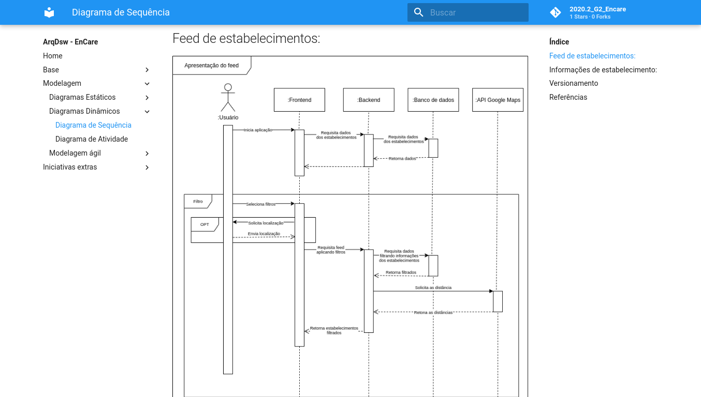
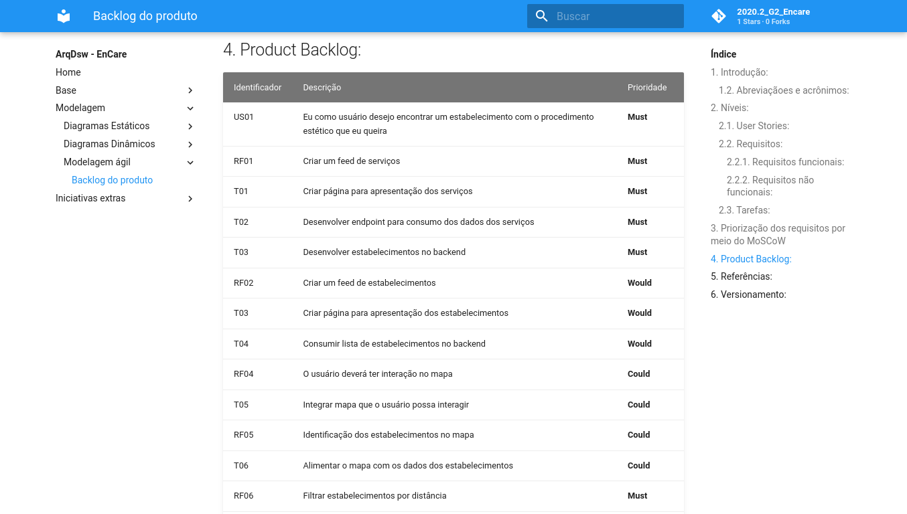
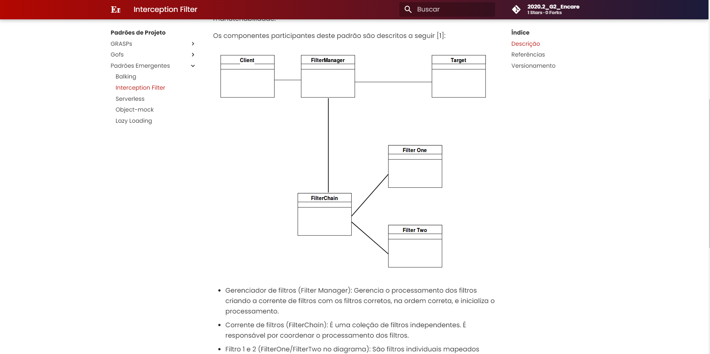

# EnCare

**Código da Disciplina**: FGA0208
**Número do Grupo**: 02

## Alunos
|Matrícula | Aluno |
| -- | -- |
| 18/0033743  | João Pedro Silva de Carvalho |
| 18/0027239  |  Renato Britto Araújo |
| 18/0033646  |  João Luís Baraky |
| 18/0029177  |  Wagner Martins da Cunha |
| 16/0124581  |  Hugo Aragão de Oliveira |
| 16/0016169  |  Nícalo Ribeiro Dourado Araújo |
| 17/0144259  |  Gustavo Nogueira Rodrigues |

## Sobre 
O objetivo do projeto é facilitar a busca por procedimentos estéticos não-cirurgicos, como cortes de cabelo, serviços de manicure e pedicure, maquiagem, entre outros. Para isso, o nosso projeto tem como proposta oferecer as ofertas disponíveis na região, de acordo com o serviço desejado e com a localização do usuário. 

## Screenshots Primeira Entrega &lt;&lt;FOCO: DSW(Base)&gt;&gt;

## Vídeo(s) Primeira Entrega &lt;&lt;FOCO: DSW(Base)&gt;&gt;
[Apresentação do Módulo Projeto Não Orientado a Abordagens Específicas](https://youtu.be/OqCiTozAYR8) 
[Apresentação do Módulo Processos/Metodologias/Abordagens](https://youtu.be/UjFOLxKm9jY)

## Screenshots Segunda Entrega &lt;&lt;FOCO: DSW(Modelagem)&gt;&gt;

## Vídeo(s) Segunda Entrega &lt;&lt;FOCO: DSW(Modelagem)&gt;&gt;  

[Apresentação Modelagem Estática](https://youtu.be/LtufoTmp0eY)  

[Apresentação Modelagem Dinâmica](https://youtu.be/Jz1-VP2KhHM)  

[Apresentação Modelagem Ágil](https://youtu.be/-za40zMGV-0)  

[Apresentação Iniciativas Extras](https://youtu.be/JcWaGilgkzo)

## Screenshots Terceira Entrega &lt;&lt;FOCO: DSW(Padrões de Projeto)&gt;&gt;  

## Vídeo(s) Terceira Entrega &lt;&lt;FOCO: DSW(Padrões de Projeto)&gt;&gt;  

[Apresentação GOFs](https://youtu.be/oNzh8aOc1qU)  

[Apresentação Padrões Emergentes](https://youtu.be/Eo-qLv7fTFk)  

[Apresentação Iniciativas Extras](https://youtu.be/TiEyO3wagP0)  

[Apresentação GRASPs](https://youtu.be/8Oc10Y0dfGk)

<!-- ## Screenshots Quarta Entrega (FINAL) <<FOCOS: Arquitetura & Reutilização de Software & PROJETO FINAL>>
Adicione 2 ou mais screenshots do projeto em termos de interface e/ou funcionamento.

## Vídeo(s) Quarta Entrega (FINAL) <<FOCOS: Arquitetura & Reutilização de Software & PROJETO FINAL>>
Adicione o(s)s vídeo(s) da Entrega Final. -->

## Descritivo dos Principais Aspectos Técnicos 
**Principal(is) Metodologia(s) Adotada(s)**: Scrum 
**Principais Linguagens Utilizadas e/ou Pretendidas**: JavaScript e Python 
**Principais Tecnologias Utilizadas e/ou Pretendidas**: React e Django 
**Principal(is) Estilo(s) Arquitetural(is) Adotado(s)**: MTV - Model Template View 

<!-- ## O Projeto está rodando?
( ) SIM
( ) NÃO
Se SIM, insira um manual (ou um script) para auxiliar ainda mais os interessados em consultar o projeto.

## Informações Complementares 
Quaisquer outras informações sobre seu projeto podem ser descritas nessa seção. -->
