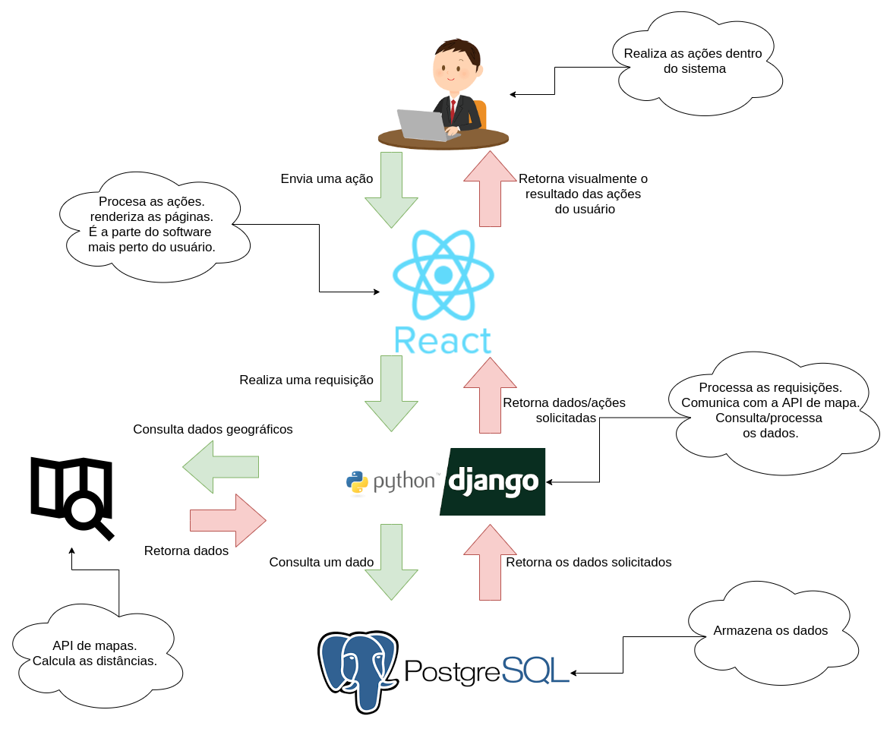
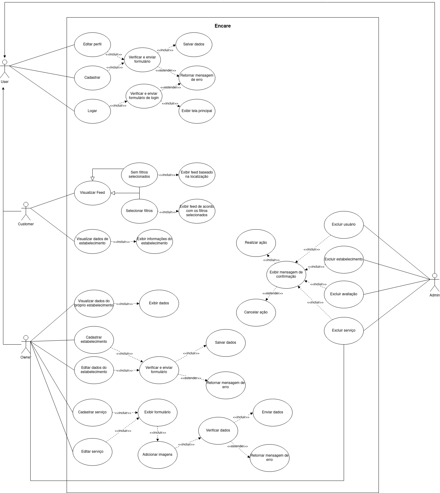
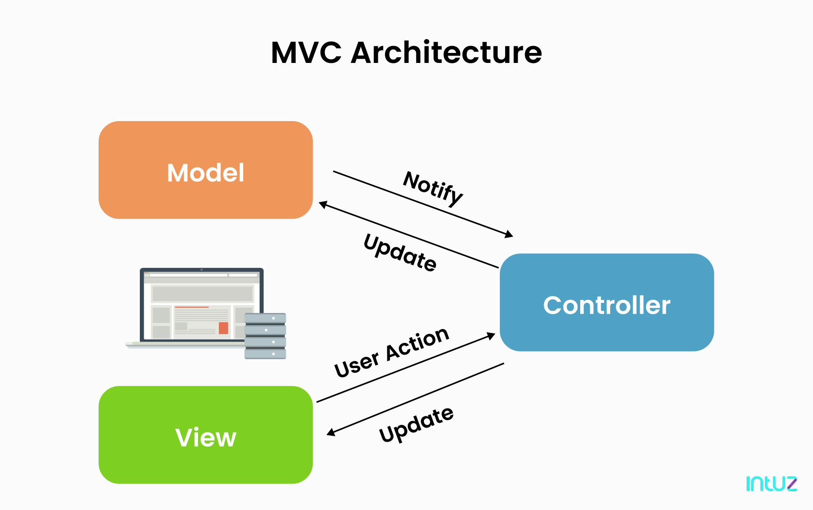
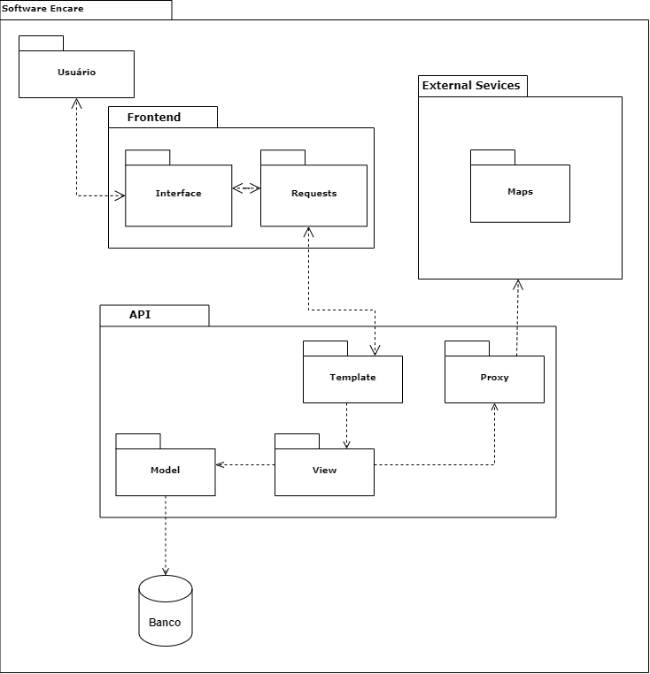
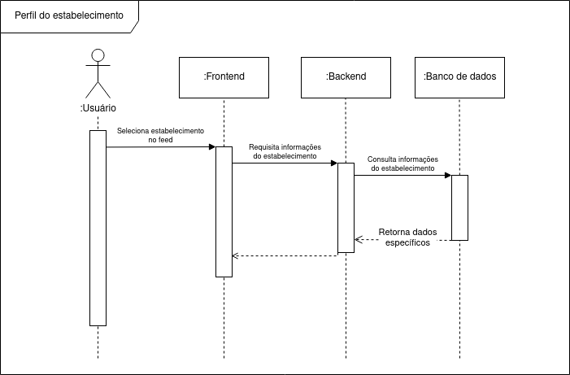
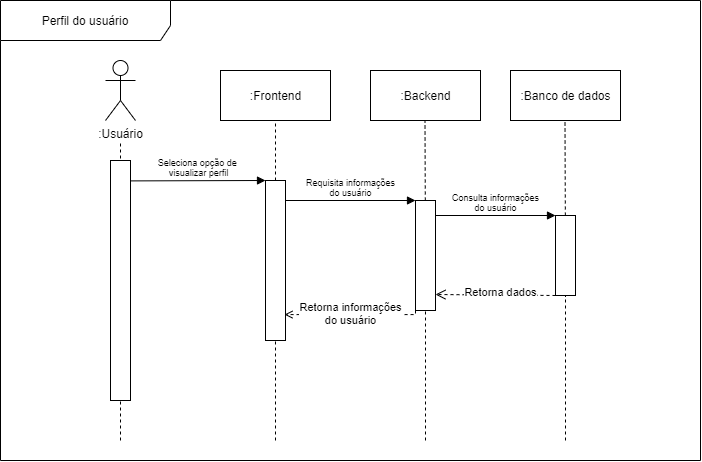
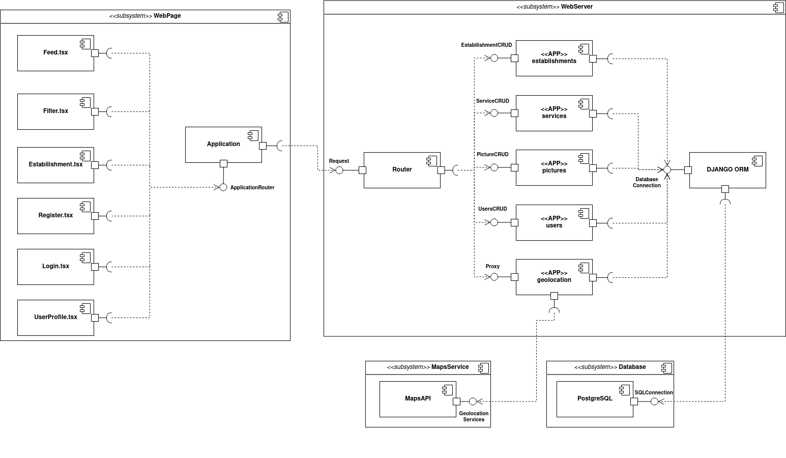
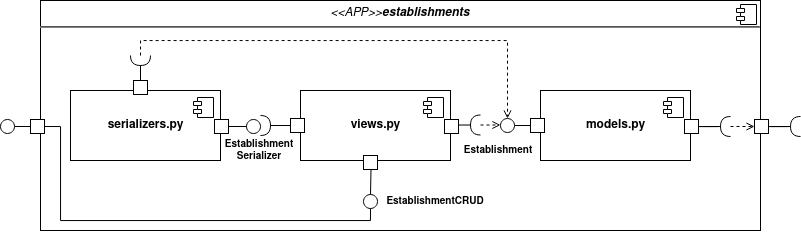

# DAS - Documento de Arquitetura de Software

## 1. Introdução

### 1.1 Finalidade

Este documento tem como finalidade especificar e documentar as decisões arquiteturais do software Encare, usando diferentes visões arquiteturais para detalhar diferentes aspectos do sistema.

### 1.2 Escopo

O escopo desse documento de arquitetura abrange todo a arquitetura do software em diferentes níveis a ser desenvolvido na disciplina. 

### 1.3 Definições, Acrônimos e Abreviações

|Sigla|Descrição|
|---|---|
|DAS|Documento de Arquitetura de Software| 
|MTV|Model Template View|

### 1.4 Visão Geral

O projeto trata de uma aplicação web que tem como objetivo facilitar a procura por serviços de cuidados pessoais. Para isso o projeto contará com uma API que utilizará o framework Django e um frontend em ReactJS

----
## 2. Representação Arquitetural

Esse diagrama mostra de uma forma mais ampla como o software irá trabalhar, mostrando como se relacionam o backend, fronted, usuário, banco de dados e API externa. Com isso podemos ter uma visão ampla sobre dodo o processo que envolve todas essas camadas de software.  

Nesse diagrama temos os seguintes participantes:
- **Usuário**: Responsável pelas ações que o sistema terá que lidar. Aqui, nessa classe, estão também os Administradores do site que irão gerenciar o site, mas também são usuário do site. 
- **Frontend ReactJS**: É a primeira camada do software em relação ao usuário e é a única parte do sistema que client-side. Tem como principal função realizar a comunicação do sistema com o usuário por meio de páginas renderizadas e as interações e a partir disso realizar as requisições necessárias. 
- **Backend Django Python**: É a primeira camada server-side e tem como função tratar as requisições, processar os dados, consultar os dados, consultar APIs externas e prover a modelagem em classes dos dados. É aqui onde ocorre a modelagem de dados.
- **API externa de Mapas**: É uma API onde possa calcular as distâcias entre duas localizações para ser usada nos filtros de distância.
- **Banco de Dados PostgreSQL**: Tem como função de armazenar e persistir os dados da aplicação. 

A seguir iremos explicar brevemente sobre cada uma das tecnologias escolhidas:

### 2.1. Python Django:

[Django](https://www.djangoproject.com/start/overview/) é um framework Python de alto nível que encorja o desenvolvimento rápido e um design limpo e pragmático. Foi construido por desenvolvedores experientes e cuida de boa parte do trabalho para que o desenvolverdor possa cuidar do mais importante. Tem como principais características:
- Desenvolvido para ser rápido como for possível.
- Inclui dezenas de extras que ajudam a resolver várias tarefas de desenvolvimento Web, como autenticação, RSS feed, entre outros...
- Cuida da segurança de muito processos, como autenticação e acesso ao banco de dados.
- É escalável para possíveis grandes demandas de requisições.
- Muito versátil

### 2.2. ReactJS:

Para o frontend, a equipe decidiu pela utilização do [ReactJS](https://pt-br.reactjs.org/), uma biblioteca JavaScript bastante popular e voltada a desenvolvimento web. As suas principais características são:
 - Baseado em componentes 
 - Pode ser renderizado no servidor através do servidor.
 - Dados são passsados das classes mães para as classes filhas por meio das props. 
 - Um componente pode usar plugins externos. 

### 2.3. PostgreSQL:

[PostegreSQL](https://www.postgresql.org/about/) é uma poderosa ferramenta de banco de dados relacional de código aberto que usa e extende as liguagem SQL com algumas funcionalidades que escalam e dimensionam as cargas de dados mais complicadas. 

Essa será a ferramenta usada para persistir os dados da aplicação.

----
## 3. Metas Arquiteturais e Restrições

### 3.1 Metas:
|Meta|Descrição|
|---|---|
|Portabilidade|O software deverá ser portátil para navegadores mobile e desktop|
|Usabilidade|O usuário deverá ser capaz de realizar as tarefas no menor tempo possível|

### 3.2 Restrições:

|Restrição|Descrição|
|---|---|
|Conectividade|A aplicação precisará de internet para trabalhar|
|Plataforma| A aplicação irá rodar somente em navegadores web|
|Público|A aplicação será voltada ao público brasileiro que seja voltado a cuidados pessoais|
|Língua|A aplicação será voltada a pessoas que falam o português do Brasil|
|Equipe|A equipe possui apenas 7 integrantes|
|Horas semanais de trabalho por integrante|4 horas|
|Deadline|A aplicação deverá ser finalizada até o fim da disciplina|
|Hospedagem|Será usada uma conta básica na Amazon AMS|

----
## 4. Visão de Casos de Uso

A visão de casos de uso apresenta uma visão próxima do usuário, descrevendo cenários de uso da aplicação.

A especificação dos casos de uso pode ser vista no documento de [especificação de casos de uso](especificacao_casos_uso.md).

----
## 5. Visão Lógica

A **visão lógica** oferece suporte aos requisitos funcionais, no que se refere aos serviços que o sistema disponibilizará para seus usuários. Nessa etapa o sistema é decomposto num conjunto de abstrações, visando a construção dos objetos, onde explora os níveis de abstração da solução, seu encapsulamento e suas relações de herança. 
### 5.1 MTV

Para representar a visão lógica desse projeto, usaremos uma estrutura bem similar ao MVC (Model-View-Controller), o MTV. O MVC é um padrão de arquitetura formulado na década de 1970, ele tem como objetivo facilitar o reuso de código e a separação de tarefas em camadas, onde a renderização dos dados e a interação com o usuários ficam separados dos métodos que interagem com os dados.

#### Aplicação do MVC

O MVC se tornou popular no desenvolvimento *web* e *mobile*, por seu fluxo de trabalho lidar bem com interfaces. Sua estrutura é compatível com linguagens como: PHP, Ruby, Javascript, Java e outras que possuem modelos adaptados da mesma. Dos componentes principais da estrutura MVC temos:

* **Model** - A Model é responsável pela parte lógica do sistema, é o módulo que faz o gerenciamento do comportamento dos dados, lógicas e funções, obedecendo as regras de negócio. Sua implementação é desenhada para responder às requisições da *controller*.
* **View** - A View é responsável por renderizar a saída dos dados, como tabelas e diagramas, por exemplo. Nela é possível programar comportamentos como a visualização de gráficos, tendo uma representação visual do que foi disponibilizado pela *Controller* a partir da *Model*.
* **Controller** - O Controller é responsável por mediar a entrada/saída, comandando a *View* e a *Model* para que sejam alteradas de forma que respeite a solicitação do usuário. O foco desse componente é lidar com a ação do usuário, onde são manipulados os dados que o usuário insere, chamando em seguida a *Model* para executar o tratamento dos mesmos.

#### MTV (Django)

No *Django* o padrão MVC foi modificado, se tornando MTV (Model-Template-View). Das semelhanças e diferenças entre MVC e MTV temos:

* Model - No MTV a Model possui a mesma responsabilidade de lidar internamente com o banco de dados e manipular esses dados.
* Template (View) - As duas possuem a mesma responsabilidade, lidando diretamente com usuário e exibindo informações.
* View (Controller) - Aqui que o MTV apresenta suas diferenças, apesar de ter responsabilidades parecidas, aqui a View retorna algo a partir de uma solicitação, pois define apenas quais dados serão representados, não como serão mostrados. No geral, a *controller* nesse padrão se comporta a partir da própria estrutura do projeto, guiando os comandos a partir das configurações de rotas no Django.

### 5.2 Aplicação no projeto
#### 5.2.1 Diagrama de Pacotes

O diagrama de pacotes a seguir visa mostrar as interações lógicas entre os módulos do sistema, de forma que exponha de forma simplificada como a aplicação se comunica.

Observando de baixo pra cima, temos as informações do Banco de Dados sendo consumidas e modeladas pela *Model*. A seguir, dentro do mesmo pacote *API*, também estão contidas as relações da *View*, *Template* e *Proxy* obedecendo as funções:

* <strong>*View*</strong> sendo responsável pela comunicação com a *Model*
* <strong>*Template*</strong> fazendo requisições à *View* e exercendo uma comunicação bilateral com a *Requests* (presente no *frontend*).
* <strong>*Proxy*</strong> servindo como uma ferramenta de intermédio da comunicação com os serviços do módulo *Maps*.

Por fim, temos as interações diretas com o usuário no *frontend*, onde a *Interface* mantêm uma comunicação recíproca com a *Requests*.

----
## 6. Visão de Processos

A visão de Processos é entendida como a divisão do sistema em precessos e processadores, no qual o sistema é separado em linhas de execução as *threads*.  

### 6.1 Diagrama de Sequência

Nessa implementação utilizamos o *diagrama de sequência* para mostrar os principais fluxos de atividades do sistema.

#### Feed de Estabelecimentos

No Feed de Estabelecimentos observamos o fluxo principal de trabalho do sistema, como a interação do usuário com o *frontend* que funciona como um intermediário entre as requisições que correspondem à busca de estabelecimentos e as relações com o *backend*.

#### Informações do Estabelecimento

O diagrama a seguir demonstra o fluxo de interações do sistema com relação à tarefa de visualizar um estabelecimento.

#### Informações do Usuário

Por fim, temos a lógica que define o armazenamento e visualização dos dados do cliente.

## 7. Visão de Implantação

A implantação do Encare já está montada utilizando o AWS como carro-chefe para
todos os serviços. Esta implementação funciona de forma simples, na perspectiva
do desenvolvedor, com um simples push para a branch correta. Pelo peso baixo da
aplicação e baixíssimo tráfego esperado no começo, os custos são zero. Além disso
é possível se extender com facilidade, a partir do GitHub Actions ou CircleCI, um
sistema de continuous integration e deploy, com testes automatizados, linters e 
outros.

A implantação é algo barato, rápido e simples graças a serviços atuais. No futuro,
pode ser que exista ainda o incentivo para realizar ações extras a partir disso,
como multiplas versões de um mesmo backend convivendo para evitar que quebras de
funcionamento para o usuário final (algo como `www.encare.com/v4/get_establishments`).

Sobre os custos, assumindo que será levantada como um serviço completamente monolítico,
podemos considerar o EC2 AWS nos custos, com uma instância simples (capaz de sustentar
tráfego até 100 pessoas simultâneas sem muito demora) em um computador de capacidade de
processamento suficiente um preço que gira em torno de R$ 100,00 por mês. 

## 8. Visão de Implementação

A visão de implementação específica os componentes de código do projeto, como organização dos arquivos, dependências e pacotes em diferentes camadas e subcamadas. Essa visão é representada principalmente pelo diagrama de componentes.

As versões anteriores do diagrama abaixo podem ser visualizadas em [Modelagem](../Modelagem/diagrama_componentes/diagrama_componentes.md).

Os componentes com a anotação <\<APP\>> têm estruturas semelhantes. O diagrama abaixo representa a aplicação de estabelecimentos:

## 9. Visão de Dados (Opcional)

Assumindo uma que cada estabelecimento envolverá uma seleção de imagens mais 
seus metadados, podemos fazer uma breve análise a partir de possíveis 
candidados para termos noção da média. Numa visita rápida ao instagram de 
alguns estabelecimentos locais, podemos notar que o numero de imagens 
relevantes para o app giram em torno de 5 a 7. O parágrafo abaixo trás o 
levantamento do teto limite para o app no Brasil, 700 mil estabelecimentos, 
e com isso temos uma aproxiamação das imagens envolvidas. Podemos considerar 
também o tamanho da imagem: em apps como o Tinder, que graficamente tem uma 
proposta semelhante ao Encare, temos que o tamanho das imagens giram em torno 
de 1000x1000px em 3 canais RGB compressado JPEG (geralmente, o tipo de 
compressão envolvida reduz em 70% o tamanho original). 

Com isso, podemos calcular o tamanho médio de cada novo estabelecimento, em 
bits, para o Encare: 5400000 bits. O teto máximo (700 mil estabelecimentos) 
seria de 3.5 terabits. Levando em conta o preço de armazenamento em núvem de
provedores comuns, temos uma média de 0.023 dólares por giga por mês, o que 
dá uma grande total mensal de 500 reais por mês para todos os 
estabelecimentos, cada um custando 0.07 centavo.

Como é possível ver, o app, em termos absolutos, é bastante leve e barato
quanto a questão de dados. Por um preço de apenas 500 reais por mês, é 
possível servir a nação inteira. Difícilmente isso seria considerado "big 
data". Neste sentido, a visão de dados é bem otimista, e utilizando sistemas 
modernos para guardar tal informação, é possível ter custos e armazenamento
quase perfeitamente escaláveis.

----
## 10. Tamanho e Desempenho

Segundo o SEBRAE, o Brasil possui aproximadamente 700 mil estabelecimentos de serviços voltados a beleza e estética. Outro dado interessante é que aproximadamente 42,3% dos consumidores desejam cuidados pessoais com a finalidade de ficarem mais bonitos. No ambiente do Distrito Federal, os estabeleciemntos de cuidados pessoais somam cerca de 8 mil estabelecimentos. 

Tendo os dados acima, podemos estimar qual será o uso da plataforma do ponto de vista dos estabelecimentos. Como o planejado é o uso do sistema inicialmente no Distrito Federal, então o sistema terá que suportar o uso por 8 mil estabelecimentos e seus respectivos clientes. Assim podemos concluir que o uso da plataforma, no caso em que todos os estabelecimentos de beleza forem cadastrados, não será sobrecarregado, visto que esse número, a nível computacional, não é relevante para desempenho. O que realmente pode pesar é o acesso simultâneo de clientes na plataforma, que, como é um número desconhecido, pode ser que interfira em um bom desempenho da aplicação. 

Em nível nacional, o desempenho tem que ser avaliado mais ainda, pois são mais de 700.000 estabelecimento, e consequentemente nesse caso pode complicar por sem um número bem maior de estabelecimentos que estarão cadastrados e ainda mais usuários do tipo cliente. Sendo assim para avançar para nível nacional, o produto pode precisar passar por uma avaliação criteriosa de desempenho para não oferecer um uso lento para o usuário (tanto dono de estabelecimento quanto cliente) a fim de evitar possíveis problemas.

Por fim é necesário destacar que essas estimativas são com base nos poucos dados disponíveis sobre possíveis usuários no Brasil e no Distrito Federal, findando em uma estimativa que pode ter uma diferença considerável para a real estimativa. 

----
## 11. Qualidade

A arquitetura descrita neste documento contribui com as seguintes características de qualidade[7]:

|Característica|Definição|Contribuição|
|----|----|----|
|Manutenibilidade| A capacidade de um software comportar modificações, melhorias, correções ou adaptação a novos requisitos. | A arquitetura documentada pode ser modificada para se adequar às modificações, trazendo mais segurança para modificações no código.
|Confiabilidade| A capacidade do software evitar falhas e manter um desempenho adequado quando elas acontecem, sob condições especificadas. | A modularização facilita o processo de testes, o que diminui o número de potenciais falhas.
|Portabilidade| A capacidade de um software operar em diferentes ambientes | A separação de responsabilidades e camadas do software permite uma melhor adaptação para diferentes ambientes de hardware e software. Esta característica está diretamente relacionada com o [RNF02](../Modelagem/backlog/Backlog.md).
|Eficiência de Desempenho| A capacidade do produto fornecer um desempenho apropriado, no que se trata de uso de recursos e tempo. | A modularização fornecida pelas modelagens contribui na avaliação de complexidade e uso de recursos.
|Usabilidade| A facilidade de um usuário compreender, aprender, utilizar e apreciar o software, quando usado sob condições especificadas. | A arquitetura do software contribui ao facilitar a modificação de recursos que afetem a usabilidade, como por exemplo, melhorar a estética, ou a prevenção a erros do usuário. Essa característica está ligada ao [RNF01](../Modelagem/backlog/Backlog.md).

----
## Referências

- [1] Template do [documento de arquitetura de software](https://github.com/UnBArqDsw2020-2/2020.2_G2_Encare/files/6305164/Software.Architecture.Document.pdf). Disponibilizado no moodle da disciplina.
- [2] React: Uma biblioteca JavaScript para criar interfaces para usuários. Disponível em: <https://pt-br.reactjs.org/>. Acesso em 19 abr. 2021.
- [3] About PostgreSQL. Disponível em: <https://www.postgresql.org/about/>. Acesso em 20 abr. 2021
- [4] Django: the web framework for perfectionists with deadlines. Disponível em: <https://www.djangoproject.com/start/overview/>. Acesso em 20 abr. 2021. 
- [5] Painel setorial de informações estratégicas - SEBRAE. Disponível em: <https://www.sebrae.com.br/Sebrae/Portal%20Sebrae/UFs/BA/Anexos/P06%20Servi%C3%A7os%20Beleza%20e%20Est%C3%A9tica%20rev01_04052018.pdf>. Acesso eme 22 abr. 2021.
- [6] Mercado da beleza cresce 8% no DF e movimenta R$ 350 milhoes por mês. Disponível em: <https://www.correiobraziliense.com.br/app/noticia/cidades/2015/07/01/interna_cidadesdf,488556/mercado-da-beleza-cresce-8-no-df-e-movimenta-r-350-milhoes-por-mes.shtml>. Acesso em 22 abr. 2021. 
- [7] KOLBERG et al. Qualidade de Software. Disponível em: <https://www.inf.ufpr.br/lmperes/2019_1/ci221/trabalhos/trab3/atividadeA/aula_fatores_qualidade_geral_iso9126_25010.pdf>. Acesso em 23 abr. 2021.
- [8] How Django Works (MVT Pattern). Code Stack, 2020. Acesso 26/04/2021. Disponível em: <https://www.youtube.com/watch?v=cyP4Uw2b2XM&ab_channel=CodeStack>
- [9] Entendendo a arquitetura do Django. Medium. Acesso 27/04/2021. Disponível em: <https://medium.com/@renatojlelis/entendendo-a-arquitetura-do-django-f4b505773c14>
- [10] A Complete Guide and comparition of MVC and MVVM. Nilay D, Nov. 2019. Disponível em: <https://www.intuz.com/blog/guide-on-mvc-vs-mvvm>. Acesso 27/04/2021.
- [11] Django's Structure - A Heretic's Eye View. The Django Book. Disponível em: <https://djangobook.com/mdj2-django-structure/>. Acesso 27/04/2021.
- [12] Introdução ao Padrão MVC. Higor, 2013. Disponível em: <https://www.devmedia.com.br/introducao-ao-padrao-mvc/29308>. Acesso 25/04/2021.
- [13] Entendendo o MTV do Django. Fagner Pinheiro, 24 de março de 2020. Disponível em: <https://www.treinaweb.com.br/blog/entendendo-o-mtv-do-django/>. Acesso 27/04/2021.
- [14] Arquitetura de Software. MONTEIRO, Marcos. Disponível em: <https://www.marcosmonteiro.com.br/mm/Cursos/Arquitetura_Software/Arquitetura_de_Software-marcosmonteiro.pdf>. Acesso: 25/04/2021
- [15] Architetctural Blueprints - The "4+1" View Model of Software Architecture. KRUCHTEN, Philippe. Published in IEEE Software 12 (6), November 1995, pp. 42-50.
- [16] MVC. Wikipedia. Disponível em: <https://pt.wikipedia.org/wiki/MVC>. Acesso 25/04/2021.

## Versionamento

|Data|Nome|Detalhes|Versão|
|----|---|---|---|
| 16/04/21 | Wagner Martins | Criação do documento | 0.1 |
| 16/04/21 | Wagner Martins | Adição da finalidade | 0.2 |
| 19/04/21 | João Pedro Carvalho | Adição da visão geral e das siglas  | 0.3 |
| 20/04/21 | João Pedro Carvalho | Adição da representação arquitetural  | 0.4 |
| 20/04/21 | João Pedro Carvalho | Adição das metas e restrições arquiteturais  | 0.5 |
| 20/04/21 | Wagner Martins | Adição do diagrama de casos de uso | 0.6 |
| 22/04/21 | Wagner Martins | Adição do diagrama de componentes na visão de implementação | 0.7 |
| 22/04/21 | João Pedro Carvalho | Adição do tamanho e desempenho | 0.8 |
| 23/04/21 | Wagner Martins | Adição das especificações de qualidade | 0.9 |
| 26/04/21 | Hugo Aragão | Adiciona descrição do padrão MVC | 1.0 |
| 27/04/21 | Hugo Aragão | Adiciona descrição do padrão MTV | 1.1 |
| 27/04/21 | Wagner Martins | Adição do link para a especificação dos casos de uso | 1.2 |
| 28/04/21 | Renato Britto Araujo | Adição da visão de dados | 1.3 |
| 28/04/21 | Renato Britto Araujo | Adição da visão de implantação | 1.4 |
| 28/04/21 | Hugo Aragão | Adiciona implementação da visão lógica | 1.5 |
| 28/04/21 | Hugo Aragão | Atualiza diagrama de visão lógica | 1.6 |
| 28/04/21 | Hugo Aragão | Adição dos diagramas de Sequência | 1.7 |
| 28/04/21 | Hugo Aragão | Adição das descrições e definições dos diagramas de sequência | 1.8 |
| 30/04/21 | João Luis Baraky | Corrige erros de ortografia | 1.9 |
| 03/04/21 | Wagner Martins | Correção na visão de implementação | 2.0 |
