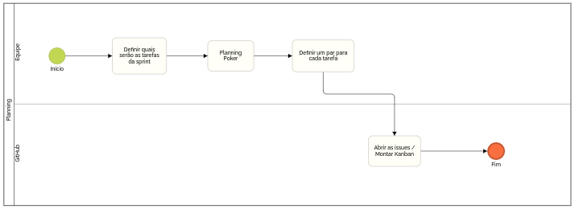

# Modelagem BPMN

A notação BPMN (Business Process Model and Notation) é uma representação gráfica (são ícones), uma linguagem, uma forma de simbolizar o fluxo de um processo, isto é, de fazer o mapeamento dos processos. Basicamente, é uma representação visual do fluxo de tarefas que existem no seu processo.

A notação BPMN permite que você desenhe e conheça todas as tarefas operacionais de um negócio de forma lógica, sequencial. É possível também identificar os papéis de cada um, os eventos e todos os demais componentes de um processo.

[Clique aqui para acessar a versão em PDF](bpmn.pdf)

## Geral

## Sprint

## Planning

## Sprint Review

## Daily

## Coleta de Dados

## Referências

CASTRO, Bruna. Notação BPMN: O que é e quando usar? Guia completo. Blog SML Brasil. Disponível em: <https://blog.smlbrasil.com.br/o-que-significa-bpmn/>. Acesso em: 17 de fevereiro de 2021.

## Histórico de versão

| Versão | Data       | Comentários                                   | Autor(es)                 |
| ------ | ---------- | --------------------------------------------- | ------------------------- |
| 0.1    | 17/02/2021 | Adição da página                              | Gustavo Nogueira & Renato |
| 0.2    | 17/02/2021 | Adição dos diagramas geral, sprint e planning | Gustavo Nogueira          |
| 0.3    | 18/02/2021 | Adição da análise da Coleta de Dados, Daily e Sprint Review | Renato Britto Araujo |
