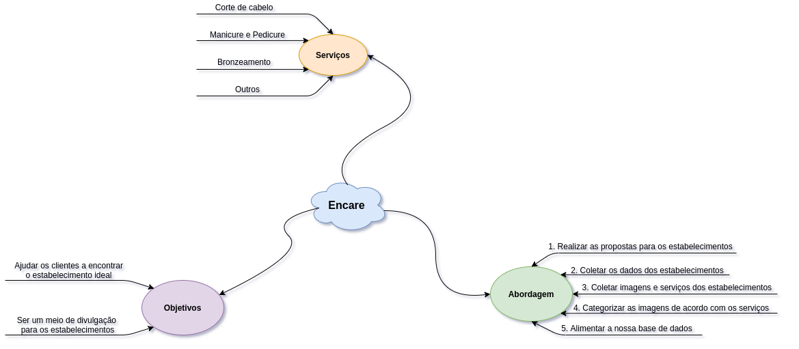
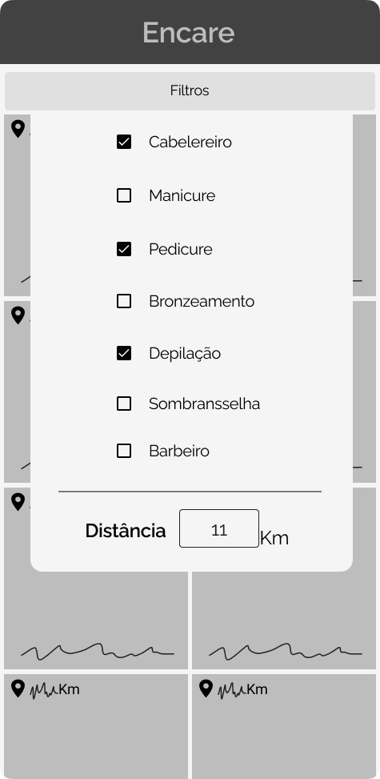

# Desing sprint
## Geração de ideias
Afim de gerar as ideias de como seria a aplicação, a equipe realizou uma reunião onde usamos a técnica de brainstorming, após isso cada membro teve que gerar o seu próprio esboço para validar as ideias discutidas.
## Esboço das ideias

Os esboços são representações de uma sessão de brainstorming realizada pela equipe, de forma assíncrona, onde todos apresentaram suas ideias de como o Encare deve ser. Os documentos a seguir são feitos em formato livre, sem compromisso com o estilo específico, haja visto que o propósito da atividade era capturar as ideias da equipe de forma crua.

Após o processo dessa captura de ideias, nós selecionamos uma delas para guiar o processo de prototipagem do projeto Encare. A decisão está descritaabaixo dos esboços.

### João Pedro

### Wagner Martins

### Renato Britto

### João Baraky

### Hugo Aragão

### Gustavo Nogueira

## Decisão

Foi feita de decisão de se selecionar o esboço de João Baraky, visto que
este captura a essência do que o Encare deve ser. Boa parte da ideia será
usada, mas algumas mudanças foram feitas para alinhar com o resto do time.

### Divergências do esboço

Foi feita a decisão de abandonar o feature representado no esboço selecionado
relacionado aos preços de cada estabelecimento. No esboço é possível ver um
feature semelhante ao iFood, onde os preços de um estabelecimento são
representados com cifrões ($).

A ideia foi abandonada pois se julgou que fosse um dado difícil de se
procurar, e caso houvesse continuidade nessa ideia, teríamos que não apenas
coletar esses dados manualmente para cada estabelecimento mas também usar
juízos de valor para definir em qual das 5 categorias de preço um dado
estabelecimento pertence.

## Protótipo

O protótipo de baixa fidelidade foi produzido a partir dos artefatos gerados, onde pudemos
revisar os elementos acordados da aplicação e geramos a versão final da ideia prototipada.

  
*Figura 1. Feed inicial*    
  
*Figura 2. Filtragem de Opções*  
  
*Figura 3. Perfil do estabelecimento*  

  

## Vesionamento:
| Data | Nome | Versão | Descrição |
|-|-|-|-|
| 16/02/2021 | João Pedro Silva de Carvalho | 0.1 | Adicionando Esboço | 
| 17/02/2021 | Wagner Martins da Cunha | 0.2 | Adicionando storyboard |
| 17/02/2021 | Renato Britto Araujo | 0.3 | Adicionando Esboço |
| 17/02/2021 | João Luis Baraky | 0.4 | Adicionando Esboço |
| 18/02/2021 | Hugo Aragão | 0.5 | Adicionando Esboço |
| 19/02/2021 | Nícalo Ribeiro | 0.6 | Adicionando Esboço |
| 19/02/2021 | Gustavo Nogueira  | 0.7    | Adicionando Esboço |
| 19/02/2021 | Hugo, João Pedro, Renato | 0.8 | Adicionando Prototipo de Baixa Fidelidade |
| 19/02/2021 | Renato Britto Araujo | 0.9 | Adiciona decisão, explicação das mudanças dela, esboço e geração de ideias. |
| 19/02/2021 | João Pedro Silva de Carvalho | 1.0 | Adiciona geração de ideias |
| 27/02/2021 | João Luis Baraky| 1.1 | Corrige erros de ortografia e concordância |

