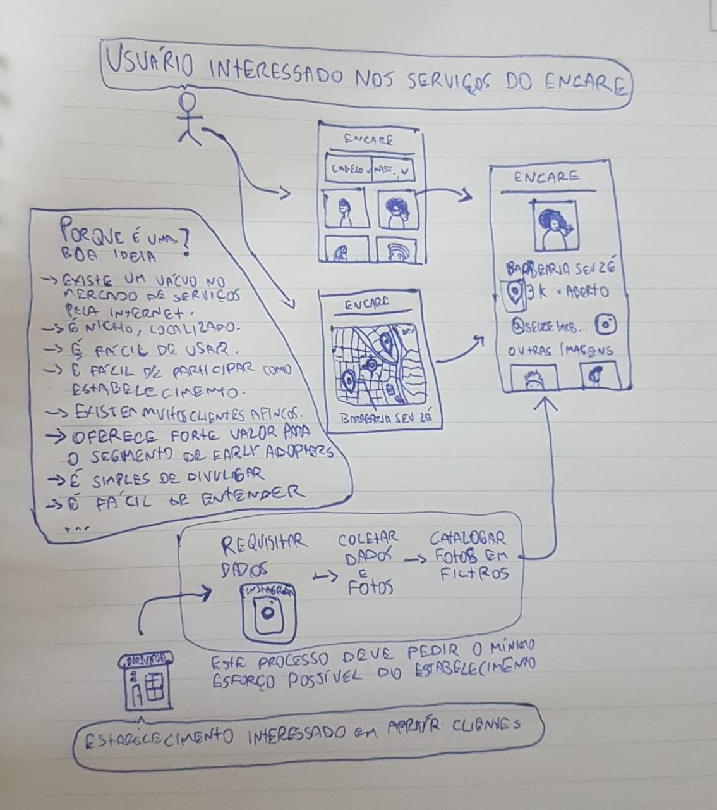

# Desing sprint.
## Geração de ideias.
## Esboço das ideias.
### João Pedro:

### Wagner Martins:

### Renato Britto:

### João Baraky:

### Hugo Aragão:

### Nícalo Ribeiro

## Decisão.
## Protótipo.
O protótipo de baixa fidelidade foi produzido a partir do artefatos gerados, onde pudemos
revisar os elementos acordados da aplicação e geramos a versão final da ideia prototipada.

<figure>

<figcaption>Figura 1. Feed inicial</figcaption>
</figure>

<figure>

<figcaption>Figura 2. Filtragem de Opções</figcaption>
</figure>

<figure>

<figcaption>Figura 3. Perfil do estabelecimento</figcaption>
</figure>

## Vesionamento:
| Data | Nome | Versão | Descrição |
|-|-|-|-|
| 16/02/2021 | João Pedro Silva de Carvalho | 0.1 | Adicionando Esboço | 
| 17/02/2021 | Wagner Martins da Cunha | 0.2 | Adicionando storyboard |
| 17/02/2021 | Renato Britto Araujo | 0.3 | Adicionando Esboço |
| 17/02/2021 | João Luis Baraky | 0.4 | Adicionando Esboço |
| 18/02/2021 | Hugo Aragão | 0.5 | Adicionando Esboço |
| 19/02/2021 | Nícalo Ribeiro | 0.6 | Adicionando Esboço |
| 19/02/2021 | Hugo, João Pedro, Renato | 0.7 | Adicionando Prototipo de Baixa Fidelidade |

