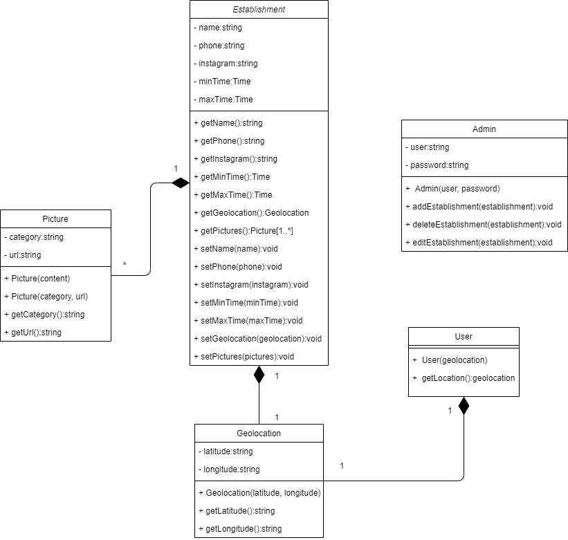

# Diagrama de Classes

## Introdução

O diagrama de classes tem como objetivo representar a estrutura e os relacionamentos entre as classes envolvidas no desenvolvimento de um projeto orientado a objetos.

# Metodologia

Foram feitas reuniões com a equipe para discutir e esclarecer quais serão as classes e seus respectivos relacionamentos que implementaremos no projeto.

## Diagrama

## Referências

> Orientações básicas na elaboração de um diagrama de classes. Disponível em: <https://www.devmedia.com.br/orientacoes-basicas-na-elaboracao-de-um-diagrama-de-classes/37224>. Acesso em: 03 de mar. de 2021

## Histórico de versão

| Versão | Data       | Comentários       | Autor(es)        |
| ------ | ---------- | ----------------- | ---------------- |
| 0.1    | 07/03/2021 | Adição do Diagrama de Classes  | Todos |
