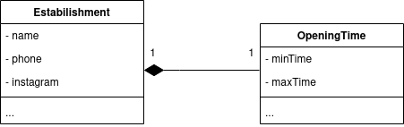
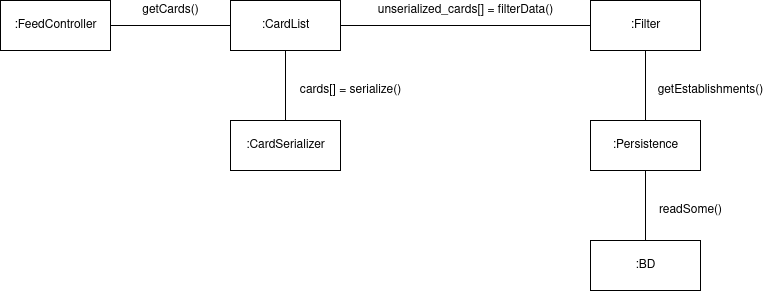
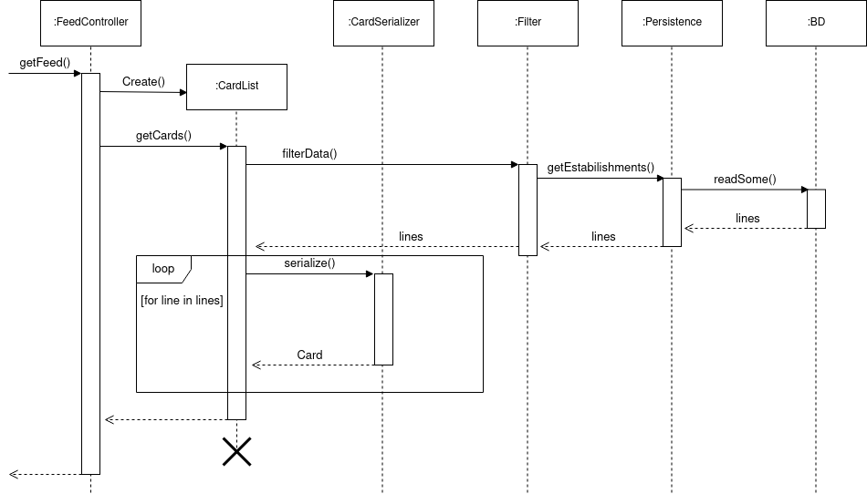

# GRASPs

<!-- ## Sobre -->

## Criador

<!-- ### O que é -->

### Aplicação no projeto

A versão 1 do diagrama de classes, mais especificamente a classe Estabilishment apresenta um baixo nível de coesão, com muitas responsabilidades de forma não especializada. Segue abaixo uma versão reduzida da mesma classe:

Os atributos minTime e maxTime representam respectivamente o horário de abertura e fechamento do estabelecimento. Estes atributos podem ser separados em outra classe, assim como seus respectivos métodos (_getMinTime()_, ou _getMaxTime()_ por exemplo). Um exemplo conceitual dessa separação pode ser visto abaixo:

A palavra **contém** indica um forte relacionamento entre as classes. Uma vez que o horário de funcionamento de um estabelecimento só faz sentido existir se o seu respectivo estabelecimento existe. Essa relação é uma composição, criando as seguintes classes:

Em suma, a classe Estabilishment é a responsável por criar uma instância da classe OpeningTime.

## Especialista

<!-- ### O que é -->

### Aplicação no Projeto

Ainda utilizando o exemplo das classes Estabilishment e OpeningTime (agora com alguns seus métodos):

A responsabilidade de guardar os dados dos horários de abertura e fechamento, assim como de retornar eles está na classe OpeningTime. Essas responsabilidades são a **especialidade** da classe, o que aumenta a coesão do sistema.

## Controlador

<!-- ### O que é -->

### Aplicação no Projeto

Para este exemplo, consideraremos a primeira história de usuário, que diz respeito a visualização do feed de estabelecimentos.

Considerando uma controladora apenas para este caso de uso**, a FeedController é responsável por passar a requisição do feed para outros módulos ou classes mais especializadas. 

O exemplo abaixo mostra um diagrama conceitual de quais componentes participariam do processamento da requisição:

Para melhor entendimento da ordem de execução, segue um diagrama de sequência para este caso:

Este é um caso básico onde a classe FeedController apenas processa uma requisição. Entretanto, caso sejam adicionadas mais requisições relacionadas ao feed, esta controladora manteria a responsabilidade de direcionar o processamento à classe correta. 

<!-- ## Alta Coesão -->

<!-- ## Baixo Acoplamento -->

<!-- ## Polimorfismo -->

<!-- ## Indireção -->

<!-- ## Fabricação ou Invenção Pura -->

<!-- ## variações Protegidas -->

## Versionamento

|Autor(es)|Data|Versão|Descrição|
|---------|:--:|:----:|---------|
|Wagner Martins| 24/03/21 | 0.1 | Criação do documento |
|Wagner Martins| 24/03/21 | 0.2 | Adição de exemplos de aplicações no projeto para os GRASPs criador, especialista e controlador

## Referências

[1] Slides das aulas, disponível no moodle da disciplina.
