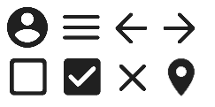

<link rel="preconnect" href="https://fonts.gstatic.com">
<link href="https://fonts.googleapis.com/css2?family=Poppins:ital,wght@0,300;1,300&display=swap" rel="stylesheet">  

# Guia de Estilo

## 1. Introdução

O guia de estilo é um artefato que serve como um manual de design e interação para o sistema de software. É um documento importante para manter o rastro de decisões acerca da interação com o sistema, de forma a deixar todos os envolvidos cientes dos padrões acordados para o projeto.

### 1.1 Objetivo

Este documento de guia de estilo visa acordar os padrões de design e interação para o software Encare. 

### 1.2 Organização e conteúdo  

Esta seção (1), se destina a explicar o que é, e para que serve o guia de estilo. A [seção 2](#2-resultado-de-analise) apresenta a descrição do ambiente de trabalho onde o Encare funcionará e a [seção 3](#3-elementos-de-interface) apresenta os elementos de design que devem ser seguidos no desenvolvimento da aplicação, como grids, cores, tipografia, entre outros.

### 1.3 Público-alvo  

O guia de estilo se destina principalmente a pessoas envolvidas no desenvolvimento do front-end do Encare, sejam desenvolvedores ou designers. Não limitado a somente estes, qualquer pessoa interessada nos padrões de design e interação deste documento podem consultar o documento.

### 1.4 Como manter  

O guia de estilo mantém o rastro dos aspectos de design do projeto, e por este motivo deve ser atualizado conforme mudanças, adições ou remoções sejam decididas.

## 2. Resultado de Análise  

### 2.1 Descrição do ambiente de trabalho do usuário  

A aplicação se destina a qualquer pessoa que queira procurar estabelecimentos que oferecem serviços de cuidados pessoais. O ambiente de uso é qualquer dispositivo (desktop ou mobile) com acesso a um navegador recente e internet.

## 3. Elementos de interface  

### 3.1 Grids  
Será utilizado o padrão de Grid de 12 Colunas. Nesse sistema, o container é dividido em 12 colunas, que representam 100% do comprimento da tela.  
Portanto, de acordo com a necessidade, a largura dos componentes deverá ser definida conforme o padrão, que é exemplificado na imagem abaixo :  

### 3.1.1 Exemplo de uso das grids  
- Para uma lista de cards, como no feed de serviços, cada elemento deverá possuir tamanho 12 (que representa 100%) em relação à seu contêiner pai. Exemplo:  
  
- Dentro de cada card, para melhor visualização e interação, é recomendado que ele seja dividido em no máximo 4 partes :  
  
- Tanto o header quanto o footer devem possuir tamanho 12, mas em relação ao body da página :  
  
- Disposição geral do site :  
    1 : Header  
    2 : Container principal   
    3 : Footer  
  
- Disposição do container principal :  
    **Modelo 1**:  
    1 : Vai conter um formulário para a aplicação de filtros  
    2 : Irá conter o feed (lista ou mapa), com ou sem filtros aplicados  
  
    **Modelo 2**:  
    1 : Vai conter um formulário para a aplicação de filtros  
    2 : Irá conter o feed (lista ou mapa), com ou sem filtros aplicados 
  

### 3.2 Tipografia  
Fonte selecionada : Poppins

<h1>Título Principal</h1>
<h2>Subtítulo<h2>
<h3>Título 3</h3>
<h4>Título 4</h1>
Lorem Ipsum is simply dummy text of the printing and typesetting industry.   
<b>Lorem Ipsum is simply dummy text of the printing and typesetting industry.</b>   
<i>Lorem Ipsum is simply dummy text of the printing and typesetting industry.</i> 

### 3.3 Símbolos não tipográficos  

Em relação aos ícones, devem ser usados os ícones do [Material-UI](https://material-ui.com/pt/components/material-icons/) no estilo arredondado.

A imagem mostra alguns ícones como exemplo. Não limitado a estes, qualquer ícone do pacote Material-UI pode ser usado.

### 3.4 Cores

- - -

## Referências
[1] BARBOSA, Simone. SILVA, Bruno. **Interação Humano Computador**. 2010. Disponível em <https://docplayer.com.br/63299367-Interacao-humano-computador.html>

- - -
## Histórico
|Data|Descrição|Autor(es)|Versão| 
|----|---------|---------|:----:|
|13/03/21 | Criação do Documento | Wagner| 0.1|
|14/03/21| Adicao dos grids e tipografia | Nícalo| 0.2
|15/03/21 | Adicao da introdução e resultados de análise | Wagner | 0.3
|16/03/21 | Definição pelo grupo dos ícones e paleta de cores | Todos | 0.4
|17/03/21 | Adicao dos ícones e paleta de cores no documento | Wagner | 0.5
