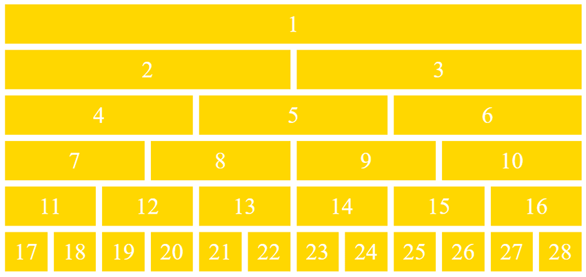
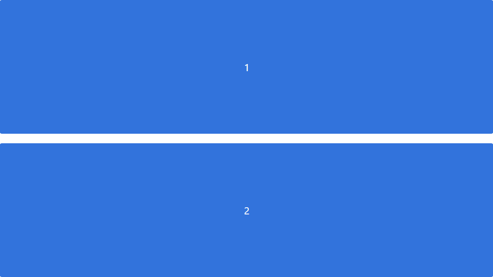

<link rel="preconnect" href="https://fonts.gstatic.com">
<link href="https://fonts.googleapis.com/css2?family=Poppins:ital,wght@0,300;1,300&display=swap" rel="stylesheet">  

# Guia de Estilo

## 1. Introdução

### 1.1 Objetivo

### 1.2 Organização e conteúdo  

### 1.3 Público-alvo  

### 1.4 Como manter  

## 2. Resultado de Análise  

### 2.1 Descrição do ambiente de trabalho do usuário  

## 3. Elementos de interface  

### 3.1 Grids  
Será utilizado o padrão de Grid de 12 Colunas. Nesse sistema, o container é dividido em 12 colunas, que representam 100% do comprimento da tela.  
Portanto, de acordo com a necessidade, a largura dos componentes deverá ser definida conforme o padrão, que é exemplificado na imagem abaixo :  

### 3.1.1 Exemplo de uso das grids  
- Para uma lista de cards, como no feed de serviços, cada elemento deverá possuir tamanho 12 (que representa 100%) em relação à seu contêiner pai. Exemplo:  
  
- Dentro de cada card, para melhor visualização e interação, é recomendado que ele seja dividido em no máximo 4 partes :  
  
- Tanto o header quanto o footer devem possuir tamanho 12, mas em relação ao body da página :  
  
- Disposição geral do site :  
    1 : Header  
    2 : Container principal   
    3 : Footer  
  
- Disposição do container principal :  
    **Modelo 1**:  
    1 : Vai conter um formulário para a aplicação de filtros  
    2 : Irá conter o feed (lista ou mapa), com ou sem filtros aplicados  
  
    **Modelo 2**:  
    1 : Vai conter um formulário para a aplicação de filtros  
    2 : Irá conter o feed (lista ou mapa), com ou sem filtros aplicados 
  

### 3.2 Tipografia  
Fonte selecionada : Poppins

<h1>Título Pincipal</h1>
<h2>Subtítulo<h2>
<h3>Título 3</h3>
<h4>Título 4</h1>
Lorem Ipsum is simply dummy text of the printing and typesetting industry.   
<b>Lorem Ipsum is simply dummy text of the printing and typesetting industry.</b>   
<i>Lorem Ipsum is simply dummy text of the printing and typesetting industry.</i> 

### 3.3 Símbolos não tipográficos  

### 3.5 Cores

- - -

## Referências
[1] Simone e Barbosa - Interação Humano Computador
Guia de estilo - página 287 (no pdf), 282 (no livro)
https://docplayer.com.br/63299367-Interacao-humano-computador.html

- - -
## Histórico
|Data|Descrição|Autor(es)|  
|----|---------|---------|   
|13/03/21 | Criação do Documento | Wagner|
|14/03/21| Adicao dos grids e tipografia | Nícalo|

