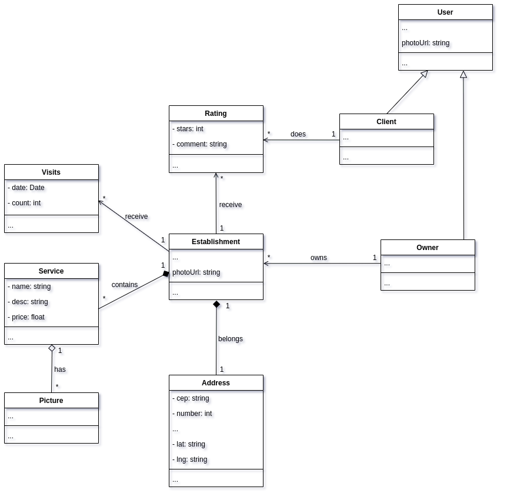
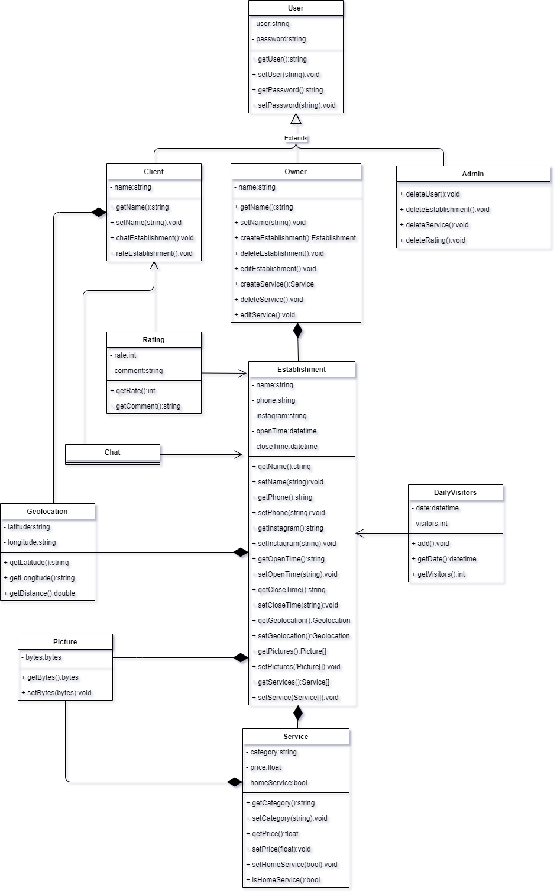
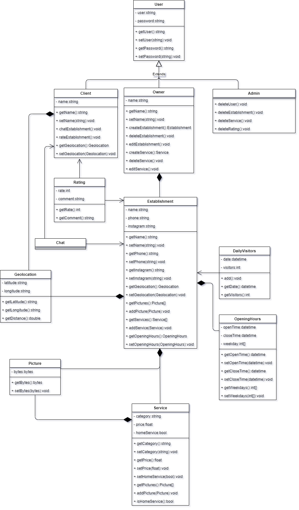

# Escopo Aumentado

## Introdução: 

O projeto atual tem um escopo bastante reduzido e por isso se viu a necessidade de criar um escopo aumentado para que possam ser melhor aplicados os padrões de projeto. Tendo isso em mente, para uma aumento de escopo mais sólido, cada membro participante da issue irá produzir sua própria visão do aumento de escopo que ela imagina e após isso irá se discutir quais são as melhores ideias convergindo para uma ideia final. Esse aumento servirá de base para aplicação dos padrões de projeto GOFs, e possivelmente dos padrões emergentes. 

Assim busca-se adicionar vários pontos de vistas ao documento e também facilitar o brainstorm para a elaboração do documento final.

## Esboços de escopo:

### João Pedro 

### Gustavo Nogueira

### Renato Britto

### João Luis Baraky

## Aumento de escopo final:
Após uma reunião entre os integrantes do grupo, decidimos as características inspiridas pelos esboços acima que irá compor o escopo final. Resultando no seguinte diagrama de classes:

### Versão 1.0:

### Versão 2.0:

### Versão 3.0:

## Conclusão:

## Versionamento:

| Nome | Data | Detalhes | Versão |
|---|---|---|---|
| João Pedro Carvalho | 23/03/2021 | Adicionando introdução e tópicos | 0.1 |
| João Pedro Carvalho | 25/03/2021 | Adicionando esboço de escopo | 0.2 |
| João Luis Baraky | 27/03/2021 | Adicionando esboço do aumento de escopo | 0.3 |
| Gustavo Nogueira | 28/03/2021 | Adicionando esboço do aumento de escopo | 0.4 |
| Todos | 29/03/2021 | Adiciona o escopo final resultante | 0.5 |
| João Baraky | 30/03/2021 | Adiciona segunda versão do escopo final | 0.6 |
| João Baraky | 31/03/2021 | Adiciona terceira versão do escopo final | 0.7 |
