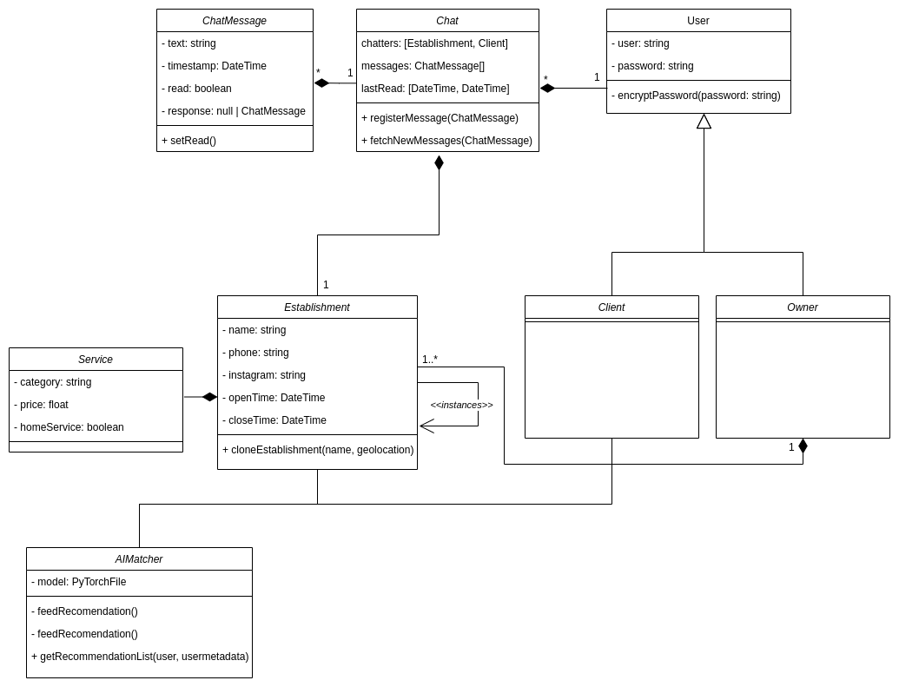
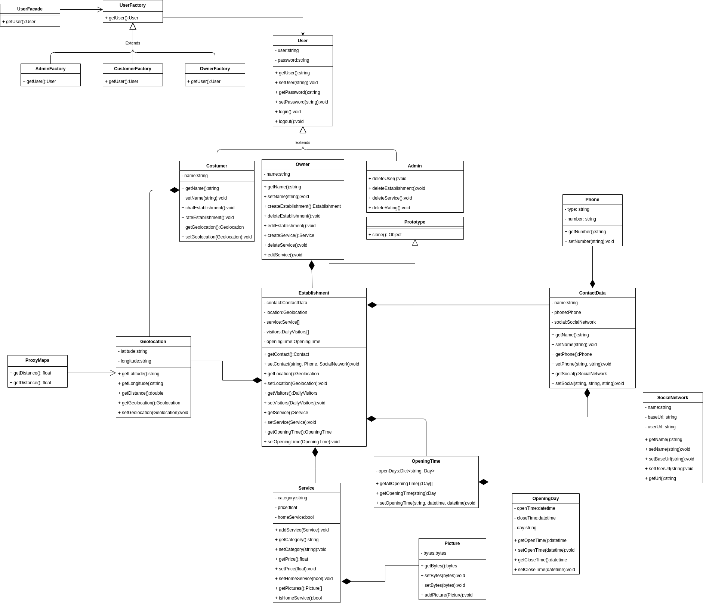

# Escopo Aumentado

## Introdução: 

O projeto atual tem um escopo bastante reduzido e por isso se viu a necessidade de criar um escopo aumentado para que possam ser melhor aplicados os padrões de projeto. Tendo isso em mente, para uma aumento de escopo mais sólido, cada membro participante da issue irá produzir sua própria visão do aumento de escopo que ela imagina e após isso irá se discutir quais são as melhores ideias convergindo para uma ideia final. Esse aumento servirá de base para aplicação dos padrões de projeto GOFs, e possivelmente dos padrões emergentes. 

Assim busca-se adicionar vários pontos de vistas ao documento e também facilitar o brainstorm para a elaboração do documento final.

## Esboços de escopo:

### João Pedro 

### Gustavo Nogueira

### Renato Britto

### João Luis Baraky

## Aumento de escopo final:
Após uma reunião entre os integrantes do grupo, decidimos as características inspiridas pelos esboços acima que irá compor o escopo final. Resultando no seguinte diagrama de classes:

### Versão 1.0:

### Versão 2.0:

### Versão 3.0:

<<<<<<< HEAD
### Versão 4.0

Após uma reunião com toda equipe e com base nos aumentos de escopo anteriores foi decido que esse escopo será usado para codificação e para apresentação do entregável.

A motivação para a utilização desse escopo ao invés do planejado inicialmente é para a implementação na prática dos padrões GRASPs e GOFs aplicados. Além disso com uma modelagem de tamanho maior é possível fazer uma análise mais profunda nos documentos de arquitetura e de reutilização culminando num aprendizagem melhor.

Será levado em conta todos os artefatos gerados até então, entretanto como o prazo não permite uma refatoração completa , a equipe nessa mesma reunião decidiu dar mais prioridade em gerar o aplicativo final. 

=======
### Versão com padões de projeto 1.0:

>>>>>>> 3e147133a0e7fd5ac13ddd3d1164bc35843d81f2

## Diagrama de Casos de Uso

Com o aumento de escopo definido, também foi criado um diagrama de casos de uso cujo objetivo é servir de apoio em casos onde a interação do usuário tenha que ser considerada.

### Versão 1.0:

## Conclusão:
Com isso, acreditamos que a adição das novas classes e features ao projeto agrega uma complexidade interessante e possibilitará uma aplicação completa dos GOFs e padrões emergentes. Além disso, chegamos a conclusão em equipe que o aumento de escopo resultante pode ser aplicado no projeto por completo sem muitas dificuldades.

## Versionamento:

| Nome | Data | Detalhes | Versão |
|---|---|---|---|
| João Pedro Carvalho | 23/03/2021 | Adicionando introdução e tópicos | 0.1 |
| João Pedro Carvalho | 25/03/2021 | Adicionando esboço de escopo | 0.2 |
| João Luis Baraky | 27/03/2021 | Adicionando esboço do aumento de escopo | 0.3 |
| Gustavo Nogueira | 28/03/2021 | Adicionando esboço do aumento de escopo | 0.4 |
| Todos | 29/03/2021 | Adiciona o escopo final resultante | 0.5 |
| João Luis Baraky | 30/03/2021 | Adiciona segunda versão do escopo final | 0.6 |
| João Luis Baraky | 31/03/2021 | Adiciona terceira versão do escopo final | 0.7 |
| João Luis Baraky | 31/03/2021 | Adiciona conclusão do documento | 1.0 |
| Wagner Martins | 09/04/2021 | Adição do diagrama de casos de uso | 2.0 |
| Todos | 09/04/2021 | Adicionando Modelagem com padrões de projeto | 3.0 |
| João Pedro Carvalho | 16/04/2021 | Adição da modelagem  | 4.0 |
