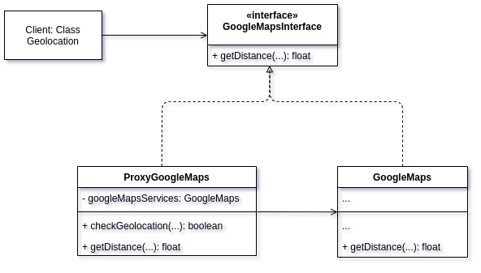

# GoFs Estruturais

## 1. Introdução

Seguindo com os padrões de projeto GOFs temos os estruturais. Esses padrões focam em como classes e objetos se compõem para formar estruturas complexas.

Sendo assim vamos apresentar os principais padrões, suas vantagens e desvantagens e como eles podem ou não ser aplicados no projeto.

### 1.1. Siglas e acrônimos:

| Termo | Representação                                              |
| ----- | ---------------------------------------------------------- |
| GOF   | Gang of Four (em referência aos 4 autores do livro em [1]) |
| SRP   | Single Responsibility Principle                            |
| OCP   | Open Close Principle                                       |
| DRF   | Django REST Framework                                      |
| SO    | Sistema operacional                                        |
| ISP   | Interface segregation principle                            |

## 2. Adapter

Converte a interface de uma classe em outra que o código cliente espera. Esse padrão permite que classes com interfaces compatíveis trabalhem juntas. Também é conhecida como Wrapper.

Sua implementação é constituído por uma interface que servirá a todas as classes _Adapter_, classes concretas _Adapter_ e por fim os objetos/classes que serão adaptados. Observa-se então que o padrão de projeto se baseia na criação de um intermediador entre o código cliente e o objeto a ser utilizado.

Metaforicamente, o adapter é um adptador de tomada que permite que um plug se conecte a tomada sem ser compatível, comportando como um intermediador.

### 2.1. Estrutura

1. O Cliente é uma classe que contém a lógica de negócio do programa existente.
2. A Interface do Cliente descreve um protocolo que outras classes devem seguir para ser capaz de colaborar com o código cliente.
3. O Serviço é alguma classe útil (geralmente de terceiros ou código legado). O cliente não pode usar essa classe diretamente porque ela tem uma interface incompatível.
4. O Adaptador é uma classe que é capaz de trabalhar tanto com o cliente quanto o serviço: ela implementa a interface do cliente enquanto encobre o objeto do serviço. O adaptador recebe chamadas do cliente através da interface do adaptador e as traduz em chamadas para o objeto encobrido do serviço em um formato que ele possa entender.

### 2.2. Vantagens

- Desacopla o código da aplicação de terceiros.
- Aplica o SRP ao separar a conversão da interface da lógica da aplicação.
- Aplica o OCP ao permitir adicionar novos _adapters_ no código exixtente.

### 2.3. Desvantagens

- Aumenta a complexidade do código.

### 2.4. Aplicação no Projeto

O próprio DRF aplica em algumas classes o padrão de projeto _Adapter_ como podemos ver [aqui](https://davenathanaeld.medium.com/design-pattern-django-rest-framework-1e8c17946bce). Para o projeto, as classes entre si, não há problemas de compatibilidade; por outro lado, a adapter pode ser usada para conversar com o banco de dados e fazer as devidas requisições.

Outro ponto interessante para o uso de _adapteres_ é em relação as imagens que são recebidas por meio de requests em formato de bytes e tratadas no código como uma classe picture.

## 3. Bridge

O _Bridge_ tem a intenção de desacoplar a abstração da sua implementação, de modo que as duas possam variar e evoluir independentemente. Outra utilização é separar uma classe grande ou um conjunto de classes intimidamente ligadas em duas hierarquias.

Segundo o livro Design Patterns [1], o padrão Bridge está sendo descrito como "Desacoplar a **abstração** da sua **implementação** então ambas podem variar independentemente.". Esses dois termos são chaves para o entendimento do padrão. Abstração é uma camada de controle de alto nível que não realiza o trabalho por si só e sim delega para uma camada de implementação.

Um bom exemplo sobre abstração e implementação é a relação entre a GUI e as APIs de um SO. A GUI (asbtração) apenas transfere as ações do usuário para que a API (implementação) realize o trabalho.

### 3.1. Estrutura

1. A Abstração fornece a lógica de controle de alto nível. Ela depende do objeto de implementação para fazer o verdadeiro trabalho de baixo nível.
2. A Implementação declara a interface que é comum para todas as implementações concretas. Um abstração só pode se comunicar com um objeto de implementação através de métodos que são declarados aqui.
3. Implementações Concretas contém código plataforma-específicos.
4. Abstrações Refinadas fornecem variantes para controle da lógica. Como seu superior, trabalham com diferentes implementações através da interface geral de implementação.

### 3.2. Vantagens

- Desacopla o código da abstração do código da implementação (SRP)
- Insere o OCP para novas abstrações/implementações para o código existente.
- Tem as mesmas vantagens do Adapter.

### 3.3. Desvantagens

- Aumenta a complexidade do projeto quando aplicada em locais inapropriados.

### 3.4. Aplicação no Projeto

Aplicar o Bridge no projeto irá aumentar a complexidade sem ter vantagens significativas, dado que poucos pontos do projeto tem essa relação abstração-implementação.

## 4. Composite

Composite é um padrão que permite que componha objetos em estruturas de árvores e então trabalhar com essas estruturas como se ela fosse objetos individuais. Esse padrão só faz sentido se a estrutura central pode ser representada como uma árvore.

Simplificando, a _Composite_ pode ser descrita como uma classe que represente toda a estrutura de árvore. Um bom exemplo para ilustrar é quando temos uma compra e a compra tem caixas que podem guardar tanto caixas quanto produtos. Essa situação pode gerar uma árvore com os produtos sendo as folhas e as caixas sendo os demais vértices. Calcular o preço nessa estrutura pode ser uma tarefa árdua e nesse caso o _Composite_ se torna bastante vantajoso de ser aplicado no código.

### 4.1. Estrutura

1. A interface Componente descreve operações que são comuns tanto para elementos simples como para elementos complexos da árvore.
2. A Folha é um elemento básico de uma árvore que não tem sub-elementos.
3. O Contêiner (ou composite) é o elemento que tem sub-elementos: folhas ou outros contêineres. Um contêiner não sabe a classe concreta de seus filhos. Ele trabalha com todos os sub-elementos apenas através da interface componente.
4. O Cliente trabalha com todos os elementos através da interface componente. Como resultado, o cliente pode trabalhar da mesma forma tanto com elementos simples como elementos complexos da árvore.

### 4.2. Vantagens

- Facilidae para criar objetos complexos por composição.
- Facilidade para gerar uma hierarquia de objetos.
- Facilidade de usar polimorfismo e recursão.
- Aplicação do OCP.

### 4.3. Desvantagens

- Dependendo da estrutura pode quebrar o ISP em estruturas folhas que podem não usar alguns de seus métodos.

### 4.4. Aplicação no Projeto

Uma possível aplicação é com relação a estrutura englobada pela classe owner, estabeliciment e suas filhas. Essa estrutura se assemelha a uma árvore, entretanto, possui várias funções distintas, sendo assim, aplicar esse padrão nesse caso acima fere o ISP.

## 5. Decorator

Decorators se tratam de classes que permitem a adição de funcionalidade sob uma outra classe base em tempo de execução. Isto é feito a partir da composição de objetos do mesmo tipo ao invés da criação de uma cadeia de heranças e uma série de estruturas condicionais. Este padrão permite que novas responsabilidades sejam atribuídas sem, necessariamente, atribuí-las ao objeto pesado.

Metaforicamente, decorators atribuem uma lista de responsabilidades dinâmicamente para a classe base alvo.

### 5.1. Estrutura

1. O Componente declara a interface comum tanto para os envoltórios como para os objetos envolvidos.
2. O Componente Concreto é uma classe de objetos sendo envolvidos. Ela define o comportamento básico, que pode ser alterado por decoradores.
3. A classe Decorador Base tem um campo para referenciar um objeto envolvido. O tipo do campo deve ser declarado assim como a interface do componente para que possa conter ambos os componentes concretos e os decoradores.
4. Os Decoradores Concretos definem os comportamentos adicionais que podem ser adicionados aos componentes dinamicamente.
5. O Cliente pode envolver componentes em múltiplas camadas de decoradors, desde que trabalhe com todos os objetos através da interface do componente.

### 5.2. Vantagens

- Permite a adição e remoção de funcionalidades em tempo de execução.
- Evita heranças quando não existe uma grande necessidade para herança.
- É possível separar o estado interno de cada uma das funcionalidades, cada qual com seu próprio conjunto de regras e propriedades, sem que elas interfiram umas nas outras, sem alongar a classe original e sem herança.

### 5.3. Desvantagens

- É possível argumentar que, em certos contextos, decorators apresentam problemas semelhantes aos causados por herança múltipla - [problema do diamante](https://en.wikipedia.org/wiki/Multiple_inheritance#The_diamond_problem). Neste sentido, se usados sem cuidado, podem causar uma refatoração geral das funcionalidades envolvidas.
- Caso muitas funcionalidades sejam adicionadas por meio de decorators, existe o risco de interferências entre si. Pelo fato de decorators separarem funcionalidades, fica mais difícil de depurar qual é a interação de dois ou mais decorators que causam o problema. Neste contexto, classes herdadadas seriam mais fáceis de serem consertadas.

### 5.4. Aplicação no Projeto

Embora a arquitetura do projeto Encare não seja complexa o suficiente para se considerar a necessidade de adicionar um decotarator no seu _stricto senso_, seu uso poderia ser feito considerando em um contexto onde cada estabelecimento tenha um comportamento diferente quanto ao seu tipo:

```python
class Estabelecimento: ...

class BarbeariaDecorator(Estabelecimento): ...
class CabeleireiroDecorator(Estabelecimento): ...

def estabelecimento_factory(args):
    """
    Cria um novo estabelecimento a partir de keywords
    """

    estabelecimento = Estabelecimento()
    if 'cabeleireiro' in args:
        estabelecimento = CabeleireiroDecorator(estabelecimento)
    if 'barbearia' in args:
        estabelecimento = BarbeariaDecorator(estabelecimento)

    return estabelecimento
```

O conceito de decorators se provou tão útil que foi abstraído para mais contextos do que apenas o que foi citado. Por exemplo, o feature da linguagem python chamado de "decorator" foi inspirado na dinamicidade que o design pattern decorator provê. Um decorator do python **não** é um padrão de projeto, mas foi inspirado no conceito. Este feature da linguagem pode vir a ser usado no Backend do projeto.

## 6. Facade

Esse padrão promove uma interface unificada para um conjunto de interfaces em um sub sistema. _Facade_ define uma interface de maior nível facilitando assim o uso do sistema.

É importante ressaltar que o objetivo não é o desacoplamento e sim facilitar o uso do sistema por parte do código cliente. Outro ponto importe é com relação a classes que tem muitas responsabilidades; o uso excessivo desse padrão concentrado em poucas clases _Facade_ pode quebrar o SRP e também o ISP, pois muitas funções podem torna a classe de propósito geral. Por mais que seja bem simples o seu uso, esse padrão requer um pouco de atenção em sua aplicação.

### 6.1. Estrutura

1. A Fachada fornece um acesso conveniente para uma parte particular da funcionalidade do subsistema. Ela sabe onde direcionar o pedido do cliente e como operar todas as partes móveis.
2. Uma classe Fachada Adicional pode ser criada para prevenir a poluição de uma única fachada com funcionalidades não relevantes que podem torná-lo mais uma estrutura complexa.
3. O Subsistema Complexo consiste em dúzias de objetos variados. Para tornar todos eles em algo que signifique alguma coisa, você tem que mergulhar fundo nos detalhes de implementação do subsistema, tais como objetos de inicialização na ordem correta e suprí-los com dados no formato correto.
4. O Cliente usa a fachada ao invés de chamar os objetos do subsistema diretamente.

### 6.2. Vantagens

- Isola o código complexo do código cliente.
- Facilita o uso do sistema
- Cria pontos de entrada para camadas da aplicação e serviços de terceiros.

### 6.3. Desvantagens

- O ISP e o RSP pode ser facilmente quebrados.

### 6.4. Aplicação no projeto

#### 6.4.1. Representação

#### 6.4.2. Código

## 7. Flyweight

Esse padrão de projeto tem como intenção usar compatilhamento para suportar um grande número de objetos de baixa granularidade. Usado quando existem uma grande quantidade de objetos semelhantes e a partir desse ponto é dividido essa classe entre um objeto que é repetido com mais frequência com um que é mais único, podendo assim existir o compartilhamento e melhorando questões de desempenho.

É um padrão de otimização que visa principalmente economizar memória RAM diminuindo o número de objetos. Deve ser usado somente se a aplicação estiver com alto consumo de RAM.

No livro Design pattern [1], os autores listam uma série de fatores para o uso do _flyweight_:

- A aplicação usa uma grande quantidade de objetos.
- Os custos de armazenamento são altos (memória e tempo de processamento).
- A maioria dos estados dos objetos podem ser compartilhados.
- Muitos objetos podem ser substituidos por poucos objetos compatilhados.
- A aplicaçaõ não depende da identidade dos objetos.

### 7.1. Estrutura

1. A classe Flyweight contém a porção do estado do objeto original que pode ser compartilhada entre múltiplos objetos. O mesmo objeto flyweight pode ser usado em muitos contextos diferentes.
2. A classe Contexto contém o estado extrínseco, único para todos os objetos originais. Quando um contexto é pareado com um dos objetos flyweight, ele representa o estado completo do objeto original.
3. Geralmente, o comportamento do objeto original permanece na classe flyweight. Nesse caso, quem chamar o método do flyweight deve também passar os dados apropriados do estado extrínseco nos parâmetros do método.
4. O Cliente calcula ou armazena o estado extrínseco dos flyweights.
5. A Fábrica Flyweight gerencia um conjunto de flyweights existentes. Com a fábrica os clientes não precisam criar flyweights diretamente. Ao invés disso, eles chamam a fábrica, passam os dados de estado intrínseco para o flyweight desejado.

### 7.2. Vantagens

- Pode economizar RAM.

### 7.3. Desvantagens

- Muito complexo em nível de código.

### 7.4. Aplicação no Projeto

Esse padrão é usado em uma situação bem específica e possui várias condições que precisam ser atendidas para que seja vantasojo ou mesmo seja possível aplicar no projeto. No caso do projeto Encare, a quantidade de objetos não é grande em nenhum dos casos e não pode ser notado nenhum consumo excessivo de memória nesse estágio do desenvolvimento (modelagem), portanto é inviário o uso desse padrão de projeto.

## 8. Proxy

De acordo com o Design Pattern[1], esse padrão tem como intenção fornecer um substituo ou um marcador de localização para outro objeto com a finalidade de controlar o seu acesso. Em outras palavras o proxy funciona como um intermediador entre o código cliente e o objeto que é necessitado. Tem uma estrutra muito similar aos padrões _Composite_ e _Decorator_.

O _Proxy_ controla todo o fluxo de informações entre o código cliente e o objeto real, podendo escolher como e quando repassar as informações inclusive. Além disso ele tem muitas variações como: _proxy_ virtual, _proxy_ remoto, _proxy_ de proteção, entre outros.

### 8.1. Estrutura

1. A Interface do Serviço declara a interface do Serviço. O proxy deve seguir essa interface para ser capaz de se disfarçar como um objeto do serviço.
2. O Serviço é uma classe que fornece alguma lógica de negócio útil.
3. A classe Proxy tem um campo de referência que aponta para um objeto do serviço. Após o proxy finalizar seu processamento (por exemplo: inicialização preguiçosa, acesso, acessar controle, colocar em cache, etc.), ele passa o pedido para o objeto do serviço.
4. O Cliente deve trabalhar tanto com os serviços e proxies através da mesma interface. Dessa forma você pode passar uma proxy para qualquer código que espera um objeto do serviço.

### 8.2. Vantagens

- O código cliente não saberá se esta usando ou não o Proxy.
- Você pode adicionar novos Proxies sem alterar o código testado (OCP)
- O proxy funciona mesmo se o obejto real não estiver operacional ou pronto para uso.

### 8.3. Desvantagens

- Aumenta a complexidade do sistema.

### 8.4. Aplicação no Projeto

É um padrão muito versátil e será utilizado no projeto como um intermediador na interação da classe _Geolocation_ com a API do Google Maps, validando a latitude e longitude e adicionando o Token da API antes de enviar o _request_.

#### 8.4.1. Representação



#### 8.4.2. Código

```python
import re
import googlemaps
from abc import ABCMeta, abstractmethod

class GoogleMapsInterface():
    __metaclass__ = ABCMeta

    @abc.abstractmethod
    def getDistance():
        raise NotImplementedError

class ProxyGoogleMaps():
    def __init__(self):
        self.googleMapsServices = googlemaps.Client(key='MY_KEY')

    def checkGeolocation(coords) -> bool:
        patternLat = 'regex_lat'
        patternLng = 'regex_lng'
        return re.search(patternLat, coords.lat) and re.search(patternLng, coords.lng)

    def getDistance(self, source, destination) -> float:
        if checkGeolocation(source) and checkGeolocation(destination):
            return self.googleMapsServices.distance_matrix(origins=source, destinations=destination)
```

## 9. Conclusão

## 10. Referências

[1] - GAMMA, Erich; HELM, Richard; JOHNSON, Ralph; VLISSIDES, John. Design Patterns: Elements of Reusable Object-Oriented Software. Indianapolis: [s. n.], 1994.
[2] - Design Pattern: Django REST Framework. Disponível em: https://davenathanaeld.medium.com/design-pattern-django-rest-framework-1e8c17946bce. Acesso em 4 abr. 2021.
[3] - Bridge. Disponível em: https://refactoring.guru/pt-br/design-patterns/bridge. Acesso em 5 abr. 2021.
[4] - Composite. Disponível em: https://refactoring.guru/pt-br/design-patterns/composite. acesso em 5 abr. 2021.

## 11. Versionamento

| Data     | Nome                                | Detalhes                                        | Versão |
| -------- | ----------------------------------- | ----------------------------------------------- | ------ |
| 4/4/2021 | João Pedro Carvalho                 | Adiciona padrão Adapter                         | 0.1    |
| 4/4/2021 | Renato Britto Araujo                | Adiciona padrão Decorator                       | 0.2    |
| 4/4/2021 | João Pedro Carvalho                 | Adiciona padrão Bridge                          | 0.3    |
| 5/4/2021 | João Pedro Carvalho                 | Adiciona padrão Composite                       | 0.4    |
| 5/4/2021 | João Pedro Carvalho                 | Adiciona padrão Facade                          | 0.5    |
| 6/4/2021 | João Pedro Carvalho                 | Adiciona padrão Flyweight                       | 0.6    |
| 6/4/2021 | João Pedro Carvalho                 | Adiciona padrão Proxy                           | 0.7    |
| 8/4/2021 | João Luis Baraky e Gustavo Nogueira | Atualiza aplicação do projeto do Facade e Proxy | 0.8    |
| 8/4/2021 | João Luis Baraky e Gustavo Nogueira | Atualiza aplicação do projeto do Proxy          | 0.9    |
| 8/4/2021 | Gustavo Nogueira                    | Adição do tópico estrutura                      | 1.0    |
