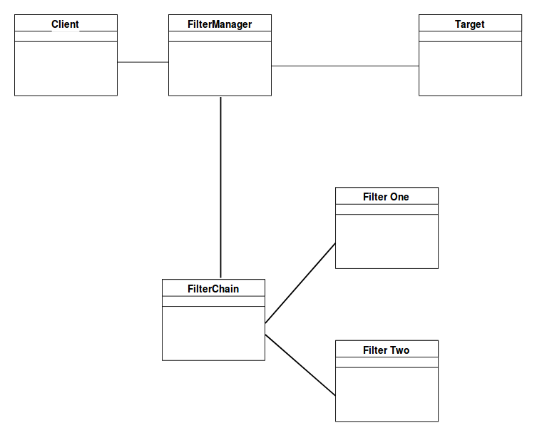

# Interception Filter

## Descrição

Em aplicações web, principalmente, é importante que as requisições passem por algumas operações de pré ou pós processamento antes de seu processamento principal ser feito, como autenticação, autorização ou _logging_ por exemplo.

 A solução clássica consiste em uma série de checagens condicionais, e abortando a requisição caso seja encontrada alguma falha. Declarações de if/else são a estratégia padrão, mas essa solução leva à fragilidade do código e um estilo de programação de copia-cola, pois o fluxo de filtragem e a ação dos filtros são compiladas dentro da aplicação. [2]

O padrão de filtro interceptor consiste em ter um mecânismo para adicionar e remover os componentes de processamento, de forma que cada componente realize uma ação de filtragem específica, fornecendo um maior nível de coesão e manutenabilidade.

Os componentes participantes deste padrão são descritos a seguir [1]:

- Gerenciador de filtros (Filter Manager): Gerencia o processamento dos filtros criando a corrente de filtros com os filtros corretos, na ordem correta, e inicializa o processamento.
- Corrente de filtros (FilterChain): É uma coleção de filtros independentes. É responsável por coordenar o processamento dos filtros.
- Filtro 1 e 2 (FilterOne/FilterTwo no diagrama): São filtros individuais mapeados para um alvo.
- Alvo (Target): É o recurso requisitado pelo cliente.
- Cliente (Client): É o objeto que envia a requisição.

## Referências

[1] - https://www.geeksforgeeks.org/intercepting-filter-pattern/ Acesso em 28/03/2021

[2] - https://www.tutorialspoint.com/design_pattern/intercepting_filter_pattern.htm Acesso em 28/03/2021

## Versionamento

|Autor|Data|Versão|Descrição|
|-----|:--:|:----:|---------|
| Wagner Martins | 28/03/2021 | 0.1 | Adição do padrão Interception Filter

