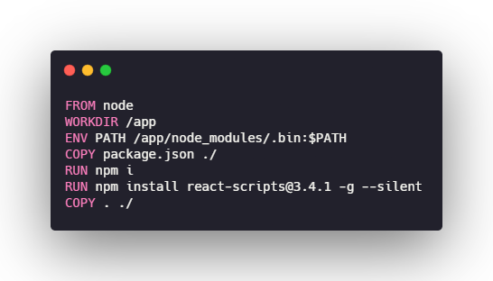
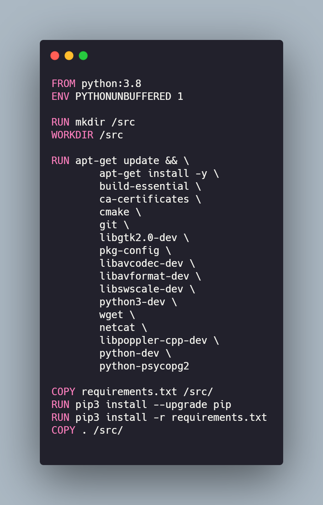
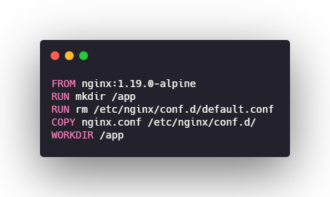
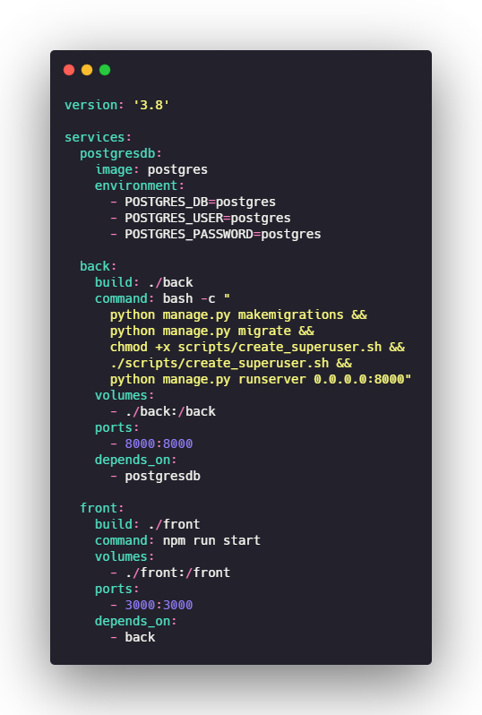

# Reutilização no Ambiente de Desenvolvimento

A reutilização de software baseia-se no uso de conceitos, produtos ou soluções previamente elaboradas ou adquiridas para a criação de um novo software, com o objetivo de melhorar a qualidade, produtividade e reduzir tempo e custos de projeto.

Reusar um produto significa poder reutilizar partes (ou o todo) de um sistema desenvolvido anteriormente, como: especificações, módulos de um projeto, arquitetura e código fonte.

## Docker

Para a reutilização no ambiente de desenvolvimento do projeto, adotamos o Docker. Trata-se uma plataforma que facilita o gerenciamento do desenvolvimento do software, padroniza e simplifica o fluxo de trabalho e, portanto, aumentando a produtividade da equipe. Em termos de reutilização, o Docker possui uma quantidade significativa de Hot Spots e alguns pontuais Frozen Spots.

- Hot-Spots: são partes específicas de sistemas individuais, projetadas para serem genéricos e adaptáveis.
    - Imagem Docker;
    - Dependências;
    - Comandos;
    - Variáveis de ambiente.

- Frozen-Spots: definem a arquitetura geral do sistema e seus componentes básicos, permanecem fixos em todas as instanciações.
    - Sistema de arquivos.

### Docker Front-end

Foi configurado um Docker com React JS para o desenvolvimento no front-end, utilizando como base uma imagem Node JS predefinida.

### Docker Back-end

Para o back-end, foi configurado um Docker com Django REST e as dependências que são necessárias para desenvolvimento, usando como base uma imagem Python predefinida.

### Docker Servidor

Para o servidor Web, foi configurado um Docker com Nginx.

### Docker Compose

Docker Compose é o orquestrador de containers do Docker. No ambiente de desenvolvimento do projeto, ele organiza o funcionamento dos Dockers configurados, oferece praticidade e produtividade, podendo subir toda a aplicação com apenas um comando.

## Referências

- Reutilização de Software - Revista Engenharia de Software Magazine 39 . Disponível em: <https://www.devmedia.com.br/reutilizacao-de-software-revista-engenharia-de-software-magazine-39/21956>. Acesso em: 21 de abril de 2021.
- Overview of Docker Compose. Disponível em: <https://docs.docker.com/compose/>. Acesso em: 21 de abril de 2021.

## Versionamento

| Data       | Nome                                           | Detalhes                                                            | Versão |
| ---------- | ---------------------------------------------- | ------------------------------------------------------------------- | ------ |
| 21/04/2021 | João Baraky, Nícalo Ribeiro e Gustavo Nogueira | Criação do documento de reutilização do ambiente de desenvolvimento | 0.1    |
