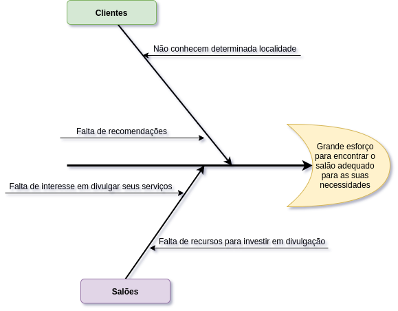

# Diagrama de Causa e Efeito

Trata-se de uma ferramenta da qualidade que ajuda a levantar as causas-raízes de um problema, analisando todos os fatores que envolvem a execução do processo. O diagrama apresenta a relação existente entre o resultado indesejado ou não conforme de um processo (efeito) e os diversos fatores (causas) que podem contribuir para que esse resultado tenha ocorrido.

## Diagrama

    

## Referências

BASTIANI, Jeison; MARTINS, Rosemary. Diagrama de Ishikawa. Blog da Qualidade. Disponível em: <https://blogdaqualidade.com.br/diagrama-de-ishikawa/>. Acesso em: 17 de fevereiro de 2021.

## Histórico de versão

| Versão | Data       | Comentários      | Autor(es)        |
| ------ | ---------- | ---------------- | ---------------- |
| 0.1    | 17/02/2021 | Adição da página | Gustavo Nogueira |
