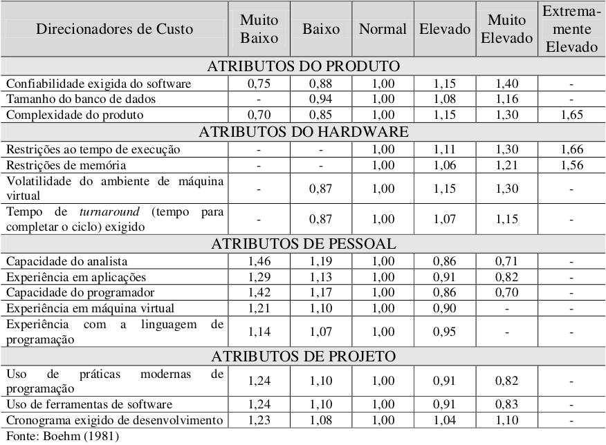

# Estimativas de custo

## Introdução

O objetivo deste documento é apresentar uma estimativa inicial de esforço e tempo necessários para o desenvolvimento do software Encare.

Segundo Fenton e Pfleeger (1997), uma estimativa é uma avaliação de probabilidade. Uma estimativa só é útil se for razoavelmente precisa. Não se espera que uma estimativa seja exata, mas que seja precisa o suficiente para que se tenha segurança de fazer julgamentos e tomar decisões, considerando os limites do intervalo de confiança.

De acordo com Hazan (2001), Calvert (1996) e Rezende (1999), as principais razões para se medir software são:

- formar uma baseline para estimativas;
- verificar se as metas de produtividade e qualidade estão sendo atingidas;
- avaliar as vantagens do uso de novos métodos e ferramentas de engenharia de software;
- melhorar o relacionamento com o cliente;
- ajudar na justificativa de pedidos de treinamento e aquisição de novas ferramentas;
- melhorar a gerência de contratos de software;
- reduzir o risco do estabelecimento de um cronograma inviável;
- melhorar a gerência de projetos de desenvolvimento de software.

## Modelos Algorítmicos

É um conjunto de modelos que apresentam um ou mais algoritmos que produzem uma estimativa de custo de software como uma função de um número de variáveis que são consideradas ser de maior importância para o custo.

Esses modelos podem ser separados a partir de métricas, sendo elas:

- orientadas ao tamanho: as estimativas de esforço e tempo são calculadas principalmente a partir do número de linhas que se estima que o software terá;
- orientadas à função: as estimativas são feitas atribuindo-se pontos de funcionalidade a partir da identificação de complexidade para diferentes tipos de arquivos, entradas e saídas;
- orientadas a complexidade: as estimativas levam em conta características como a quantidade de operadores e operandos presentes no código, ou o fluxo de controle de um programa.

Para as estimativas iniciais do projeto Encare, utilizamos uma técnica de métricas orientadas ao tamanho, conhecida como COCOMO.

## COCOMO - COnstructive COst MOdel

O Modelo de Custo Construtivo é apresentado em uma hierarquia de modelos, sendo eles:

- COCOMO Básico: computa o esforço e o custo de desenvolvimento considerando uma estimativa do tamanho do programa (em LOC - Linhas de Código).
- COCOMO Intermediário: computa o esforço e o custo de desenvolvimento considerando uma estimativa do tamanho do programa e um conjunto de direcionadores de custo.
- COCOMO Detalhado: além das características do COCOMO intermediário, inclui uma avaliação do impacto dos direcionadores de custo sobre cada etapa do desenvolvimento.

O modelo COCOMO pode ser aplicado em três classes de projetos:

- Modo Orgânico: projetos simples, relativamente pequenos, com conjuntos de requisitos não tão rígidos, com equipes pequenas e experientes.
- Modo Semidestacado: projetos intermediários (em tamanho e complexidade), com alguns requisitos rígidos e outros não tão rígidos, com níveis mistos de experiência nas equipes.
- Modo Embutido: projetos com conjunto rígido de restrições operacionais, tanto em hardware, quanto em software.

## COCOMO Intermediário

Para o cálculo dos esforços, utilizamos o COCOMO Intermediário, uma vez que o modelo considera mais aspectos além de apenas o tamanho do software, de forma a poder aumentar a precisão da estimativa.

Os requisitos do projeto na fase inicial não apresentam grande rigidez, mas têm características a se considerar, como as imagens que devem ser corretamente filtradas e os estabelecimentos devem apresentar dados corretos. Considerando também as diferenças de experiência dentro da equipe, o cálculo será aplicado usando o modo semidestacado.

O modelo utiliza a seguinte equação para estimativa de esforço:

E = a x S^b x fae

sendo:
 E: o esforço aplicado (em pessoas-mês).
 S: o número (estimado) de linhas de código para o projeto (em milhares).
 a: um coeficiente fornecido na figura 1.
 b: um expoente fornecido na figura 1.
 fae: o Fator de Ajustamento do Esforço

O Fator de Ajustamento do esforço é calculado multiplicando os atributos dos Direcionadores de custo. Os valores da multiplicação são escolhidos a partir de valores que devem ser dados entre "muito baixo" e "extremamente elevado". Esses atributos podem ser visualizados na Figura 2.

Figura 1. Coeficientes do COCOMO Intermediário. Fonte: [2]

 

Figura 2. Direcionadores de custo do COCOMO Intermediário. Fonte: [2]

Para a estimativa de tempo, segue-se a seguinte equação:

T = c x E^d

sendo:
 T: o tempo de desenvolvimento (em meses cronológicos).
 E: o esforço aplicado (em pessoas-mês).
 c: um coeficiente fornecido na figura 3.
 d: um expoente fornecido na figura 3.

Figura 3. Coeficientes do COCOMO básico. Fonte: [2]

## Cálculos das estimativas

O fator de ajustamento de esforço foi calculado conforme os seguintes multiplicadores concordados pela equipe:

- Atributos do produto
	- Confiabilidade exigida do software: 1.15 (Elevado)
	- Tamanho do Banco de Dados: 1.08 (Elevado)
	- Complexidade do produto: 1.00 (Normal)
- Atributos do hardware
	- Restrições ao tempo de execução: 1.00 (Normal)
	- Restrições de memória: 1.00 (Normal)
	- Volatilidade do ambiente de máquina virtual: 1.00 (Normal)
	- Tempo de turnaround (tempo para completar o ciclo) exigido: 1.00 (Normal)
- Atributos de pessoal
	- Capacidade do analista: 1.00 (Normal)
	- Experiência em aplicações: 0.91 (Elevado)
	- Capacidade do programador: 0.86 (Elevado)
	- Experiência em máquina virtual: 1.00 (Normal)
	- Experiência com a linguagem de programação: 1.00 (Normal)
- Atributos de projeto
	- Uso de práticas modernas de programação: 0.91 (Elevado)
	- Uso de ferramentas de software: 1.00 (Normal)
	- Cronograma exigido de desenvolvimento: 1.10 (Muito Elevado)

Para a quantidade de linhas em KLOC (linhas de código em milhares), foram considerados os módulos abaixo, derivados dos requisitos elicitados.

- Backend
	- API dos estabelecimentos - 200 linhas
	- Script para mandar os dados do google forms para o banco de dados - 20 linhas

- Frontend
    - Tela do feed de serviços - 300 linhas
    - Tela do perfil do estabelecimento - 200 linhas
    - Consumir a API do backend - 50 linhas
    - Consumir a API do Google maps - 50 linhas

Embora as linguagens ainda não tenham sido decididas, as estimativas de linhas foram feitas pensando em linguagens nas linguagens python e javascript.

Dados os valores de fae = 0.973 e S = 0.82, temos como resultado da estimativa de esforço:

E = 3 * 0.82^1.12 * 0.973

**E = 2.33 pessoas-mês**

e a estimativa de tempo:

T = 2.5 * 2.33^0.35

**T = 3.3 meses**

## Histórico de revisões

|Nome|Versão|Data|Descrição|
|-|-|-|-|
| Wagner Martins | 0.1 | 16/02/2021 | Introdução e modelos de estimativa |
| Wagner Martins | 0.2 | 17/02/2021 | Realização dos cálculos das estimativas |

## Referências

- [1] Documento de estimativas de custo do repositório **A Monitoria**. Disponível em: https://2019-2-arquitetura-desenho.github.io/wiki/dinamica_seminario_I/estimativas_de_custo/
- [2] Meller, Maristela Corrêa. Modelos Para Estimar Custos De Software: Estudo Comparativo Com Softwares De Pequeno Porte. 2002. Disponível em: https://repositorio.ufsc.br/xmlui/handle/123456789/82351
